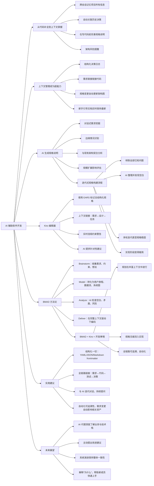
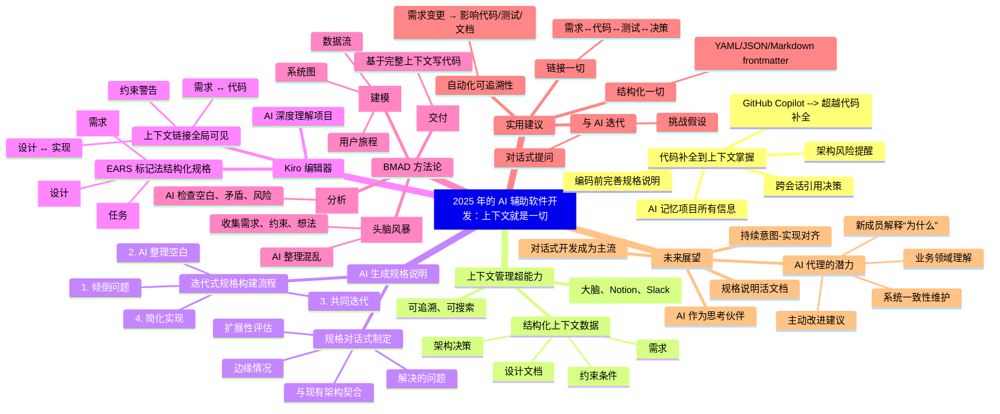
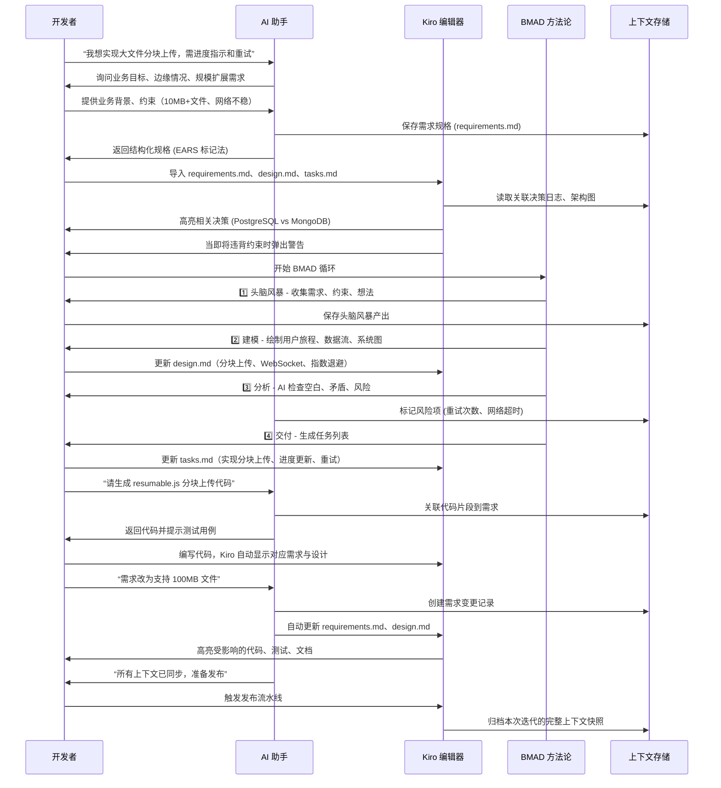
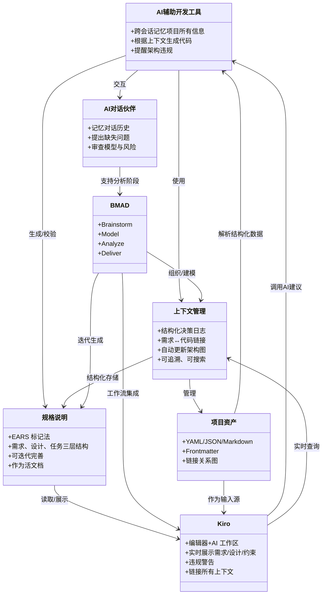

# 2025 年的 AI 辅助软件开发：上下文就是一切

以下内容在几年前听起来还像是科幻小说：我现在花更多时间与 AI 讨论我想构建什么，而不是真正去构建它。而且说实话？这是我效率最高的一次。🚀

2025 年，游戏规则已经彻底改变。我们早已超越了简单的代码补全和“帮我写个函数”这类提示。如今的 AI 开发工具能够理解上下文、记住对话，并能通过轻松的聊天帮助设计整个系统。让我分享一下我在一线看到的情况。

## 从代码补全到上下文掌握 ✨

还记得 GitHub Copilot 刚推出时，我们都为“超级增强版自动补全”而疯狂吗？现在看来那已经显得有些朴素了。真正的革命不在于生成代码，而在于理解应该生成什么样的代码。

我现在每天使用的工具实现了某种“魔法”：

- 它们能跨会话记住我项目的所有信息  
- 当我今天编码时，它们会浮现几周前我做出的相关决策  
- 它们帮助我在写一行代码之前完善规格说明  
- 它们能在我即将破坏自己的架构时提醒我 🤦‍♂️  

这不仅仅是更快的开发——而是更聪明的开发。

## 为什么上下文管理成了我的超能力 💪

让我实话实说：在我的职业生涯中，项目的上下文信息一直存在于我的大脑、零散的 Notion 文档和三个月前的 Slack 消息中。听起来是不是很熟悉？

上下文管理彻底改变了这一切。现在，我把所有项目信息——需求、架构决策、约束条件、设计文档——都当作结构化数据来处理，这样人类和 AI 都能真正使用。

### 实际操作中的样子

我不再需要翻找旧消息来回忆为什么选择 PostgreSQL 而不是 MongoDB，我现在有：

- AI 可以引用的结构化决策日志  
- 直接链接到代码的需求  
- 当我更改规格时会自动更新的架构图  
- 真正保持更新的新手引导文档 📚  

最棒的是？当有人问“我们为什么这样构建”，我不需要在记忆中挖掘。上下文就在那里，可追溯、可搜索。

## AI 生成的规格说明：改变游戏规则 🎯

事情变得疯狂的地方在这里。我现在在编写任何代码之前，会先与 AI 合作制定规格说明。不只是“帮我写需求”，而是关于以下问题的真正来回对话：

- 我们真正想解决的是什么问题？  
- 我们遗漏了哪些边缘情况？  
- 这与我们现有的架构如何契合？  
- 如果规模扩大 10 倍会怎样？  

### 迭代式规格构建的魔力

我现在的典型工作流程：

1. 把我所知道的问题全部倾倒出来  
2. AI 帮助整理并找出我遗漏的空白  
3. 我们一起迭代，直到规格说明稳固  
4. 实现变成最简单的部分  

这就像拥有一个从不疲倦、从不忘记细节、总是提出正确问题的高级架构师。🧠

## Kiro：真正理解的编辑器 🛠️

最近我一直在试用 Kiro，这是第一个真正为 AI 优先世界构建的编辑器。它不仅仅是一个“智能”文本编辑器，更像是一个会思考的开发工作区。

### Kiro 的不同之处

使用真正的 EARS 标记法的结构化规格说明：

```markdown
## 需求 (requirements.md)

WHEN 用户上传大于 10MB 的文件  
THE SYSTEM SHALL 显示进度指示器  

WHEN 上传因网络问题失败  
THE SYSTEM SHALL 自动重试最多 3 次  

## 设计 (design.md)

### 架构

- 使用 resumable.js 的分块上传  
- 通过 WebSocket 连接进行进度跟踪  
- 带有指数退避的重试逻辑  

## 任务 (tasks.md)

- [ ] 实现分块上传客户端  
- [ ] 添加 WebSocket 进度更新  
- [ ] 构建带退避机制的重试功能  
```

这不仅仅是文档——而是从需求到设计再到实际实现任务的“活”上下文。

- **无处不在的上下文链接**：当我编码一个功能时，Kiro 会显示原始需求、相关的架构决策，甚至在我即将违反上个月设定的约束时警告我。就像拥有完美的记忆力。🧵  
- **真正理解我项目的 AI**：因为 Kiro 拥有所有这些结构化上下文，它的 AI 建议不是通用的——而是针对我的目标、约束和现有模式的。

## BMAD：终于有了合理的方法 📋

最近我偶然发现了 BMAD 方法论（Brainstorm, Model, Analyze, Deliver），立刻就明白了。就像有人把我已经在做的事情编码化，并赋予了结构。

### BMAD 如何改变了我的工作流程

- **头脑风暴**：我不再直接跳到解决方案，而是花时间在一个地方收集需求、约束和疯狂的想法。AI 帮助我整理混乱。  
- **建模**：这是魔法发生的地方。我将原始想法转化为正式模型——用户旅程、数据流、系统图。正如他们所说，让思考变得可见。  
- **分析**：AI 审查所有内容，找出空白、矛盾和风险。就像团队中有一个偏执的架构师（以最好的方式）。  
- **交付**：现在我才开始写代码，但它已经由所有这些丰富的上下文所驱动。而且上下文会随着我学到更多而不断演进。🔄  

### BMAD + Kiro = 开发禅境

在 Kiro 中使用 BMAD 方法论就像拥有超能力：

- 所有规划都在上下文丰富的环境中进行  
- 规格说明无缝流入实现  
- 没有什么会被丢失或遗忘  
- 持续改进是内置的  

## 上下文驱动开发的实用建议 💡

经过几个月的实验，以下才是真正有效的：

### 1. 结构化一切

使用 YAML、JSON 或带 frontmatter 的 markdown。让它对机器可读，这样 AI 可以帮助你。你未来的自己会感谢你。

### 2. 链接一切

将规格说明链接到代码，代码链接到测试，决策链接到结果。像 Kiro 这样的工具使这变得无缝，但你可以从简单的 markdown 链接开始。

### 3. 与 AI 迭代

不要只是丢下需求就走开。进行对话。问“我遗漏了什么？”让 AI 挑战你的想法。

### 4. 让可追溯性自动化

当需求发生变化（它们一定会变化）时，你希望知道哪些代码、测试和文档需要更新。自动化这一点，否则你会花一生时间追踪依赖。

## 未来是对话式的 🗣️

我们正朝着一个软件开发更像协作式设计思维而非传统编码的世界前进。我现在花更多时间表达我想要什么，而不是思考如何实现它。

2025 年获胜的团队正在掌握：

- 将上下文作为竞争优势  
- 将 AI 作为思考伙伴，而不仅仅是代码生成器  
- 将规格说明视为活的、呼吸的文档  
- 在意图与实现之间保持持续对齐  

## 接下来是什么？🚀

我相信我们只是触及了表面。想象一下 AI 代理能够：

- 像了解你的技术栈一样了解你的业务领域  
- 根据变化的需求主动提出改进建议  
- 在系统演进时保持其整体一致性  
- 通过解释“为什么”而不仅仅是“是什么”来引导新团队成员  

像 Kiro 这样的工具和像 BMAD 这样的方法论正在为我们指明方向。问题不是这个未来是否会到来——而是我们是否准备好迎接它。

你在上下文驱动开发方面有什么经验？你是否在使用任何帮助管理代码背后“为什么”的工具？我很想听听你的工作流程实验——给我发消息，让我们交流一下！✉️

**P.S.** - 如果你还没有尝试 Kiro 或实验 BMAD 风格的规划，2025 年绝对是深入探索的一年。学习曲线是值得的。

## 本文章配图

- 流程图


- 思维导图


- 序列图


- 类图

