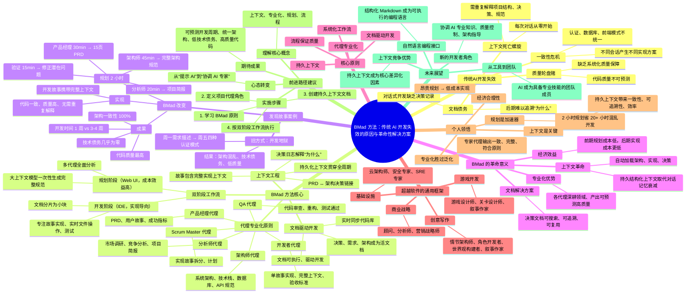
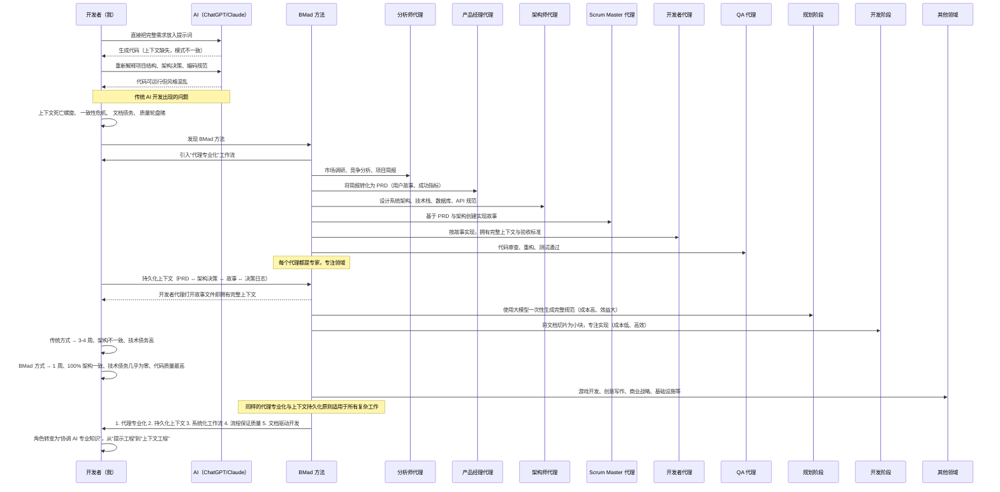
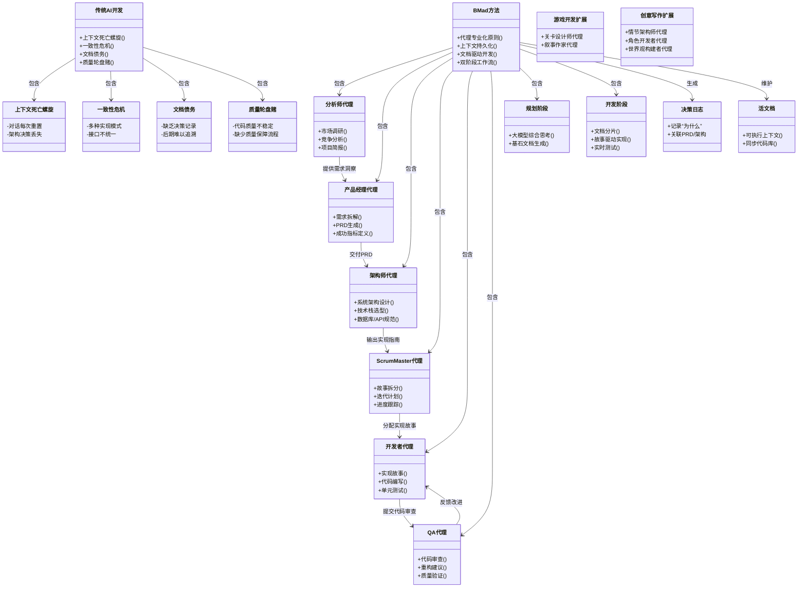

发现 BMad 方法：为什么传统 AI 开发方式已经失效（第一部分）

**2025年7月25日**

六个月前，我深陷在 AI 辅助开发的混乱中。你是否也有同感？😅 你有一个绝妙的想法，打开 Claude 或 ChatGPT，把需求一股脑丢进一个巨大的提示词里，然后祈祷一切顺利。有时它奏效，但更多时候不行。AI 会丢失上下文，忘记你的架构决策，最终你得到的代码虽然能运行，但感觉像是由五个从未交流过的开发者写的。

然后我发现了 **BMad 方法（突破性敏捷 AI 驱动开发方法）**，一切都变了。这不是另一个 AI 编程助手，也不是又一个提示工程技巧。这是一个完整的开发方法论，将混乱的 AI 开发转变为系统化、可预测的成功。🚀

让我带你回顾我的发现之旅，解释为什么传统 AI 开发从根本上是失效的，以及 BMad 方法是如何解决这些问题的。

---

## 我未曾意识到的问题 🤔

几个月来，我以为自己通过直接跳入 AI 辅助编码是“高效的”。需要一个功能？打开 ChatGPT，输入需求，开始迭代。但事实是这样的：

### 上下文死亡螺旋 🌪️

每次对话都从零开始。我得在每次会话的前 20 分钟重新解释项目结构、架构决策和编码规范。AI 生成的代码在孤立情况下能运行，但破坏了我已有的模式。

### 一致性危机 🎭

不同的 AI 会话对相同问题产生了不同的解决方案。我的认证系统在五个组件中用了三种不同的模式。数据库查询没有统一规范。前端组件像是由不同团队构建的。

### 文档债务 📚

因为一切都是对话式的，我没有记录架构决策。几周后添加功能时，我记不起当初为什么做某些选择——AI 也记不起来。

### 质量轮盘赌 🎲

有时 AI 生成的代码非常出色，可以直接上线；有时则勉强能运行。我永远不知道会得到哪种结果，也没有系统化的方法来保证质量。

---

## 一切改变的时刻 ⚡

我在一个复杂的全栈项目中首次接触到 BMad。我一直在多个 AI 工具之间切换，试图在规划、架构和实现之间保持上下文。我的对话历史庞大、矛盾且难以导航。

就在这时，我在 GitHub 的一个讨论中看到了这样一条评论：

> “问题不是 AI 不会写代码，而是我们试图让一个 AI 做所有事情。真正的团队有专家。为什么我们的 AI 团队没有？” 🤯

这让我深入研究，最终找到了 BMad 方法的仓库。我发现了一个框架，它将我一直在努力表达的东西系统化了：**AI 开发需要像人类开发团队一样专业化和流程化。**

而真正的突破在于我理解了 BMad 的核心洞察：**上下文是一切，而上下文管理是一个工作流问题，而不是工具问题。** 💡

---

## BMad 方法为何具有革命性 🔥

### 代理专业化原则 👥

传统 AI 开发是这样的：

> 你：“给我做一个带用户认证、实时更新和响应式 UI 的任务管理应用。”  
> AI：生成 47 个文件，模式不一致，边缘情况缺失，架构决策混乱 😵‍💫

而 BMad 开发是这样的：

- **分析师代理 🔍**：调研市场，识别竞争对手，创建全面的项目简报  
- **产品经理代理 📋**：将简报转化为详细的 PRD，包含功能需求、用户故事和成功指标  
- **架构师代理 🏗️**：设计系统架构、技术栈、数据库结构、API 规范  
- **Scrum Master 代理 📝**：根据架构和 PRD 创建详细的实现故事  
- **开发者代理 💻**：一次实现一个故事，拥有完整上下文和明确验收标准  
- **QA 代理 ✅**：审查代码，重构以提升质量，确保测试通过  

每个代理都是专家，有明确角色，专注于自己的领域。结果是：**一致、可上线的软件，遵循架构原则和编码规范。** 🎯

---

### 上下文工程，而非提示工程 ⚙️

BMad 的精妙之处在于：你不再需要每次都写出完美的提示词，而是构建**持久的上下文**，贯穿整个开发周期：

- **PRD 直接链接到架构决策 🔗**  
- **故事包含完整的实现上下文 📖**  
- **架构文档与代码库同步更新 🏛️**  
- **决策日志解释每个选择的“为什么” 🧠**

当开发者代理打开一个故事文件时，它已经完全理解要构建什么、如何构建以及为什么构建——**无需你再次解释。** ✨

---

### 文档驱动开发 📚

每个决策、需求和架构选择都成为**活文档**。但这些不仅仅是文档——它们是**可执行的上下文**，驱动开发流程。

当产品经理创建 PRD 时，它不会被丢在 Google Docs 里积灰。它会被“分片”成更小、更专注的文档，开发者代理在实现时可以直接使用。🔄

---

### 双阶段工作流 ⚡

该方法认识到规划和开发有不同的需求：

#### 阶段 1：规划（Web UI - 成本效益高） 💰

- 使用大上下文模型进行综合思考  
- 一次性生成完整规范  
- 利用多个代理进行全面分析  
- 创建指导一切的基石文档  

#### 阶段 2：开发（IDE - 实现导向） 🛠️

- 将大文档分片为可管理的小块  
- 执行专注的开发周期，保持上下文清晰  
- 一次一个故事，顺序推进  
- 实时文件操作和测试  

这种分离在经济上非常聪明：**昂贵的大上下文模型用于复杂思考，高效的专注代理用于实现。** 🧠💻

---

## 我的 BMad 发现故事 📚

让我告诉你我意识到传统 AI 开发失效的确切时刻。我当时正在构建一个名为“Steps”的目标管理应用——一个看似简单的项目，却变成了一场噩梦。😱

### 旧方式：开发地狱 🔥

我的“高效”AI 开发流程是这样的：

- **周一**：兴奋地向 ChatGPT 描述我的梦想生产力应用 🚀  
- **周二**：发现生成的代码用了错误的认证模式，重新开始 😤  
- **周三**：新对话，不同 AI 会话，完全不同的数据库设计 🤦‍♂️  
- **周四**：前端组件与后端 API 结构完全不一致 🤯  
- **周五**：五个文件中出现了四种不同的认证系统 😵‍💫  

三周后，我得到了：

- 四种不同的认证模式 🔐  
- 三个不兼容的数据库结构 📊  
- 完全不一致的前端组件 🎨  
- 没有任何架构决策的文档 📄  
- 一个被迫手动重写的代码库 😰  

---

### BMad 的启示 ✨

然后我发现了 BMad 方法。我没有再用“更好的”提示词重新开始，而是决定采用一种完全不同的方法：**在编写任何代码之前进行系统化规划。** 💡

#### 规划革命（总计 2 小时） 🔄

- **分析师代理会话（20 分钟） 🔍**：不是直接跳入功能，而是提出我从未考虑过的问题：

  > “谁会使用这个应用？忙碌的专业人士还是目标导向的 Z 世代？”  
  > “你在解决哪些现有生产力应用没有解决的痛点？”  
  > “六个月后成功是什么样子？用户的生活会如何改善？”

  结果：一份全面的项目简报，识别了我的真实需求（而不仅仅是听起来很酷的功能）。🎯

- **产品经理代理会话（30 分钟） 📋**：将我的模糊想法转化为具体需求：

  - 详细的用户画像和具体需求  
  - 可衡量的功能和非功能需求  
  - Epic 分解，逻辑清晰  

  结果：一份比我职业生涯中任何 PRD 都更全面的 15 页文档。📑

- **架构师代理会话（45 分钟） 🏗️**：设计出一个真正可实现的系统：

  - 带有正确关系和约束的数据库结构  
  - 一致模式的 REST API 规范  
  - 匹配数据流的前端组件层级  
  - 真正有效的安全模型  

  结果：完整的架构规范，包含图表、API 文档和实现指南。📊

- **产品负责人验证（15 分钟） ✅**：发现并修正了三个我遗漏的潜在问题，确保一切对齐。

**总规划时间：2 小时 ⏱️**  
**成果：专业级规范，消除了架构猜测 🏆**

---

### 实现的魔力 ✨

最让我震惊的是：我不再需要从零开始，希望 AI 记住之前的对话，而是拥有了每个开发决策的完整上下文。🤯

#### 上下文丰富的开发故事 📖

当我需要实现 Steps Method 的目标层级时，开发故事包含了：

- 完整的架构上下文（为什么是 Goals → Milestones → Steps 结构、数据关系、用户流程）  
- 明确的实现任务和验收标准  
- 对已建立设计模式的引用  
- 与整体策略匹配的测试要求  

#### 一致的实现 🎯

开发者代理从未问过“我们应该用哪种认证系统？”或“数据库结构应该怎样？”它已经知道，因为决策已被记录并可访问。

#### 无上下文丢失 🔄

与传统 AI 开发不同，每个故事都无缝建立在之前的工作之上。

---

### 令人震惊的结果 🚀

- **开发时间**：1 周，而非通常的 3-4 周 ⏱️  
- **架构一致性**：100% - 每个组件遵循相同模式 🏆  
- **技术债务**：几乎为零 - 决策被记录并遵循 ✅  
- **代码质量**：高于我手动编写的任何代码 💯  
- **信心**：我可以向任何人解释任何架构决策 😎  

最重要的是，三个月后添加功能时，所有上下文仍在。无需重新解释，无需架构考古——只需基于文档的实现。🕰️

---

## 为什么这改变了所有事情 🔥

### 上下文革命 🔄

传统 AI 开发失败的原因是**上下文衰减**。每次对话都从零开始。你花更多时间解释项目，而不是构建它。而 BMad 让上下文变得**持久且结构化**。🧠

不再是：

> “还记得我们正在构建一个 SvelteKit 和 FastAPI 的生产力应用吗？” 🙄  
> “像我上次说的那样…” 😒  
> “我之前描述的 Steps Method 层级结构…” 😵‍💫

而是：

- **自动加载完整架构上下文 ⚙️**  
- **包含完整背景的实现故事 📖**  
- **跨所有代码的一致模式 🎯**  
- **可追溯的决策文档 🔗**

---

### 专业化优势 👥

真正的开发团队有专家。你的数据库架构师不会设计 UI 组件。你的前端开发者不会写部署脚本。BMad 将同样的专业化原则应用于 AI 代理。🧠

每个代理：

- 在其领域拥有深度专业知识 🎆  
- 拥有清晰、专注的上下文 🔍  
- 产出可预测、高质量的输出 🎯  
- 建立在其他专家的工作之上 🤝

---

### 文档解决方案 📚

传统 AI 开发中，架构决策存在于无法搜索或引用的对话历史中。而 BMad 让每个决策成为**活文档**，可以：

- 指导未来开发 🧭  
- 几个月后仍可参考 🕰️  
- 创建机构知识 🧠  
- 实现一致的团队开发 👥

---

## 核心原则 ⚙️

1. **代理专业化 👥**  
   就像人类团队一样，AI 代理在特定领域拥有专业知识和明确职责时效果最佳。

2. **上下文持久化 🔄**  
   决策和架构选择被记录在贯穿整个开发周期的文档中。

3. **系统化工作流 📝**  
   不是随意提示，而是确保不遗漏任何步骤的验证流程。

4. **通过流程保证质量 ✅**  
   结构和检查清单确保一致质量，而不是靠运气。

5. **文档驱动开发 📚**  
   规范不仅仅是文档——它们是驱动整个流程的可执行上下文。

---

## 超越软件：通用框架 🌍

让我震惊的是：**BMad 方法不仅适用于软件开发**。其原则适用于任何受益于专业化和系统化思维的复杂工作。🤯

该框架包括扩展包，适用于：

- 游戏开发 🎮：游戏设计师、关卡设计师、叙事作家  
- 创意写作 ✍️：情节架构师、角色开发者、世界观构建者  
- 商业战略 📈：顾问、分析师、营销战略师  
- 基础设施 ☁️：云架构师、安全专家、SRE 专家  

我在一个副项目中测试了创意写作扩展包，看到专业代理像软件开发一样协作：

- 情节架构师设计故事结构 📝  
- 角色开发者创建详细角色画像 👤  
- 世界观构建者建立设定一致性 🌏  
- 叙事作家产出润色文本 ✨  

同样的系统化方法，不仅创造了更好的软件，也创造了更好的创意作品。🏆

---

## 我对 AI 开发的领悟 💡

经过六个月的 BMad 使用，我发现了关于 AI 辅助开发的一些基本真理：

### 规划不是负担，而是加速器 🚀

**旧观念**：“规划拖慢我” 😒  
**现实**：2 小时的结构化规划节省 20+ 小时的混乱开发 ⏱️

规划过程能发现：

- 我不知道存在的需求缺口 🕳️  
- 后期会破坏系统的架构冲突 ⚠️  
- 我未考虑的集成挑战 🤔  
- 实际构建范围的现实评估 🎯

---

### 专业化胜过泛化 🏆

**旧方式**：“一个 AI 应该处理所有事情” 🤷‍♂️  
**现实**：专业化代理产出显著更好的结果 💯

比较输出：

- 通用 AI 提示：不一致的模式、缺失的边缘情况、可疑的架构 😵‍💫  
- 专业化 BMad 代理：一致的模式、全面的思考、遵循既定原则 ✨  

就像让通才设计数据库 vs 雇佣数据库架构师的区别。🏗️

---

### 上下文是改变游戏规则的关键 🔄

突破性认知：**上下文管理不是锦上添花，而是高质量 AI 开发的基础。** 💡

有了持久上下文：

- 无需重复解释决策 ⏱️  
- 所有实现中的一致模式 🎯  
- 几个月后仍能保持项目节奏 🚀  
- 反映现实的文档 📚

---

### 经济效益合理 💰

传统 AI 开发：便宜提示 → 昂贵调试 💸  
BMad 方法：昂贵规划 → 便宜、可预测的实现 💹

总成本更低，质量更高，时间线可预测。🏆

---

## 下一步：你的前进路径 🚀

如果你读到这里，你可能在想：“这听起来很棒，但我从哪里开始？” 🤔

### 推荐你这样做：

#### 从理解开始，而不是工具 🧠

在下载任何东西或设置代理之前，先内化这些核心概念：

- **上下文是一切** - 持久上下文胜过聪明提示 🔄  
- **专业化很重要** - 不同阶段需要不同 AI 专业知识 👥  
- **规划加速开发** - 前期思考节省大量后期时间 ⏱️  
- **流程创造质量** - 结构化产出胜过靠运气 ✅

---

### 心态转变 🔄

BMad 方法要求你以不同方式思考自己的角色。你不再是使用 AI 工具，而是**协调 AI 专业知识**。不再是：

> “我怎么更好地提示？” 😒  
> “为什么 AI 不理解我想要什么？” 😤  
> “我怎么在对话中保持上下文？” 😵‍💫

而是：

> “哪个专家应该处理这个阶段？” 🤔  
> “这个代理需要什么上下文才能成功？” 💡  
> “这些交付物如何连接以指导开发？” 🔗

---

### 超越炒作 ✨

BMad 方法不是魔法——它是将经过验证的原则系统化应用于 AI 辅助工作。**“魔法”来自：**

- **不会衰减的持久上下文 🔄**  
- **专注专业知识的代理 🎆**  
- **指导未来工作的文档 📚**  
- **确保一致结果的质量流程 ✅**

它的革命性在于将最佳实践编码为可重复的框架，而不是依赖运气和聪明提示。🏆

---

## 更大的图景：这对开发意味着什么 🌍

BMad 方法不仅仅是更好地使用 AI 工具的方式。它是对 AI 原生时代软件开发方式的预览。🚀

### 从工具到团队 👥

我们正从“帮助我编码的 AI”转向“拥有专业技能的 AI 团队成员”。这不是要取代开发者，而是以系统化、可预测的方式增强人类创造力。🤝

### 新的开发者角色 👨‍💻

你的角色从“编写代码”转变为“协调 AI 专业知识”：

- 愿景设定和质量控制 🎯  
- 战略监督和架构指导 🏗️  
- 资源管理和优先级方向 📋  
- 创意解决问题和创新 💡  

不再是与 AI 工具斗争，而是指导 AI 专家。🎤

---

### 上下文作为竞争优势 🏆

掌握上下文工程的公司将构建得更快、更一致、质量更高。通过 AI 系统维护和传递知识的能力将成为核心差异化因素。🚀

---

### 自然语言作为编程接口 💬

BMad 证明了当结构化得当时，自然语言可以成为精确、强大的编程接口。一切都是人类可读的 Markdown：

- 代理定义和工作流 📝  
- 模板和检查清单 ✅  
- 文档和规范 📚  

这使整个系统变得可访问、灵活且协作性强。🤝

---

## 准备好改变你的开发方式了吗？

如果你被我分享的故事所触动——如果你厌倦了 AI 开发的混乱，准备好迎接系统化成功——那么你已经准备好探索 BMad 方法了。

在本系列的**第二部分**中，我将带你：

- 如何设置和使用 BMad 方法  
- 不同项目类型的逐步工作流  
- 包含完整上下文的真实示例  
- 避免常见陷阱的实用技巧  
- 如何根据你的需求定制框架  

在**第三部分**中，我们将深入探讨：

- 高级技巧和定制  
- 构建自定义扩展包  
- 经济效益和 ROI 分析  
- AI 辅助开发的未来  

---

## 总结

BMad 方法不仅仅是更好地使用 AI——它是从根本上改变你进行软件开发的方式。它是关于构建系统而非功能，创建上下文而非对话，指导 AI 专业知识而非与 AI 工具斗争。

转变是真实的。方法论是有效的。问题是：你准备好停止与混乱的 AI 开发斗争，开始系统化构建了吗？

开发的未来是协作的、系统化的，而且已经到来。

---

**即将推出第二部分：《BMad 方法实战：你的完整实施指南》** —— 我将带你一步步设置 BMad 方法，提供不同项目类型的完整工作流和可跟随的真实示例。

你是否也经历过 AI 开发的混乱？欢迎联系我：hello@buildmode.dev

## 本文章配图
- 思维导图

- 序列图

- 类图

