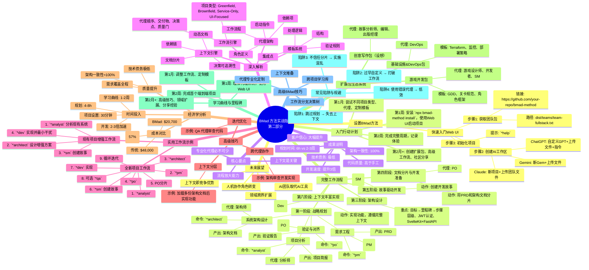
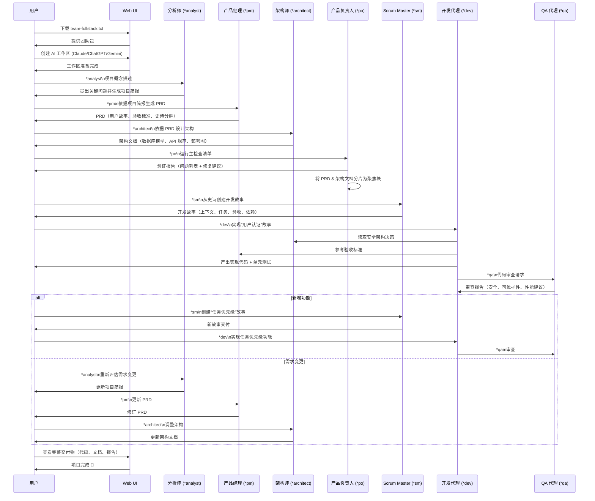
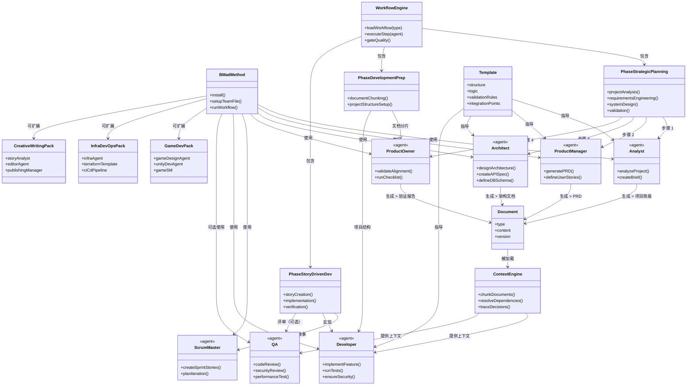
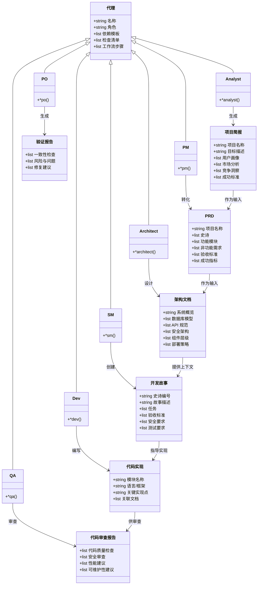

# BMad 方法实战：你的完整实施指南（第二部分）

**2025年7月26日**

在[第一部分](#)中，我分享了我的发现故事，并解释了为什么传统的 AI 开发方式是行不通的。如果你还没有阅读，建议你先从那里开始了解完整背景。📚

现在让我们进入实践环节。本指南将向你展示如何在开发流程中具体实施 BMad 方法。我们将逐步讲解完整的工作流程、真实案例，以及你需要的一切，将混乱的 AI 开发转变为系统化的成功。🚀

---

## 设置 BMad 方法 ⚙️

如果你已经阅读过第一部分，可以跳过这部分 —— 我们直接进入实施环节！🚀

### 快速入门：Web UI 方式 ⚡

体验 BMad 的最快方式是通过 Web UI。以下是具体设置步骤：

#### 步骤 1：获取团队包 📦

- 前往 [BMad 方法仓库](https://github.com/your-repo/bmad-method)
- 进入 `dist/teams/`
- 下载 `team-fullstack.txt`（或与你的项目类型匹配的文件）

#### 步骤 2：创建你的 AI 工作区 💻

- **Claude**：创建一个新项目，并将团队文件作为项目知识上传 🤖
- **ChatGPT**：创建一个自定义 GPT，并上传文件，附带指令：“你的关键操作说明已附上，请不要脱离角色” 💬
- **Gemini**：创建一个新的 Gem，并上传该文件 💎

#### 步骤 3：初始化你的第一个项目 🚀

使用以下提示开始：

```
*help
```

这将显示所有可用的代理和命令。现在你已经准备好开始！🎉

---

## 完整的 BMad 工作流程 🔄

BMad 方法遵循系统化的两阶段方法。让我通过一个真实案例带你走完整个流程。📊

### 第一阶段：战略规划（推荐使用 Web UI） 💰

此阶段创建指导一切的基础文档。使用 Web UI 配合大上下文模型（如 Gemini、Claude 或 GPT-4）以提高成本效益。🧠

#### 步骤 1：项目分析 🔍

- **代理**：分析师 👨‍💼
- **命令**：`*analyst`
- **目标**：创建全面的项目简报 📊

**示例会话：**

```
*analyst

我想构建一个名为“Steps”的目标与任务管理应用，帮助用户将人生大目标分解为可实现的里程碑和可管理的每日步骤。它应该帮助职场活跃的专业人士和 Z 世代用户重新掌控日程，实现工作与生活的平衡。
```

分析师会提出深入问题，例如：

- “你的目标用户是谁？30-40 岁的职场专业人士，还是目标导向的 Z 世代？” 🤔
- “你解决了哪些现有生产力应用未能解决的具体痛点？” 🎯
- “6 个月后成功的标准是什么？用户的生活将如何改善？” 📈
- “你在生产力领域的竞争格局如何？” 🏁

**预期输出**：一份 10-15 页的全面项目简报，包括市场分析、用户画像、竞争洞察和成功标准。🏆

#### 步骤 2：需求工程 📋

- **代理**：产品经理（PM） 👨‍💼
- **命令**：`*pm`
- **目标**：将简报转化为详细的 PRD 📝

**示例会话：**

```
*agent pm

根据我们的项目简报，为 Steps 目标管理应用创建一份全面的 PRD。
```

PM 代理将：

- 将简报转化为结构化需求 📊
- 创建详细的用户故事和验收标准 📖
- 定义功能性和非功能性需求 ⚙️
- 分解史诗和功能模块 📦
- 建立成功指标 🎯

**预期输出**：一份 15-25 页的详细 PRD，包含用户故事、需求、验收标准和史诗分解。📚

#### 步骤 3：系统架构设计 🏗️

- **代理**：架构师 👷
- **命令**：`*architect`
- **目标**：设计技术实现方案 📊

**示例会话：**

```
*agent architect

根据 PRD 为我们的 Steps 应用设计系统架构。重点是目标 → 里程碑 → 步骤的层级结构、用户认证和可扩展的 SvelteKit + FastAPI 架构。
```

架构师将创建：

- 数据库模式及关系 📊
- API 规范 🔌
- 安全架构 🔒
- 组件层级 🏠
- 技术栈建议 🛠️
- 部署策略 🚀

**预期输出**：一份完整的架构文档（10-20 页），包含图表、规范和实施指南。📑

#### 步骤 4：验证与对齐 ✅

- **代理**：产品负责人（PO） 👨‍💼
- **命令**：`*po`
- **目标**：确保一致性与可行性 🎯

**示例会话：**

```
*agent po

运行主检查清单，验证我们的 PRD 和架构文档之间的一致性。
```

PO 将：

- 验证 PRD 和架构的一致性 🔗
- 识别潜在问题或差距 🔍
- 提出优化建议 ✨
- 验证可行性 🎯

**预期输出**：验证报告，包含识别的问题和修复建议。📈

---

## 第三阶段：架构设计

架构师代理接手：

```
*agent architect
从我们的 PRD 出发，设计系统架构，重点是 Steps 方法的层级结构和用户目标管理
```

最终生成的架构文档包括：

- 显示目标 → 里程碑 → 步骤数据流的系统图
- 使用 JWT 认证和安全用户数据的安全架构
- 包含目标管理 REST 端点的 API 设计
- 用户目标、里程碑和每日步骤的数据库设计
- 前端为 SvelteKit、后端为 FastAPI 的部署架构
- Steps 方法的用户体验策略

**关键点**：架构师不只是画图，而是创建了可执行的上下文，包括具体的技术选择、安全模式和实施指南，供开发代理直接使用。

---

## 第四阶段：文档分片与开发准备

在开始编码前，我使用 PO 代理对文档进行“分片”：

```
*agent po
将我们的 PRD 和架构文档分片，用于开发流程
```

这将庞大的规划文档分解为聚焦、可操作的部分：

- 包含特定用户故事的史诗文件
- 聚焦于单个服务的架构组件
- 编码标准和模式
- 每个组件的安全要求

---

## 第五阶段：故事驱动开发

接下来是魔法时刻。我不再面对空白的代码编辑器，而是让 SM（Scrum Master）代理创建详细的故事：

```
*agent sm
从史诗 1 中创建下一个开发故事
```

SM 创建的故事包括：

- 来自架构决策的完整上下文
- 具体的实施任务和验收标准
- 此功能的安全要求
- 测试要求和边缘情况
- 依赖项和集成点

---

## 第六阶段：上下文丰富的实现

最后，开发代理接手：

```
*agent dev
实现用户认证故事
```

与普通 AI 编码不同的是，开发代理拥有完整的上下文。它知道：

- 为什么选择 JWT 而不是会话（架构决策）
- 如何实现 HIPAA 合规的日志记录（安全要求）
- 使用哪种加密标准（合规要求）
- 如何与特定的 OAuth 提供商集成（技术规范）

**结果**：生产就绪的代码，完全遵循我们的架构决策，无需我再次解释。

---

## 成果说明一切

- **规划时间**：6 小时 vs. 我通常的 2-3 周逐步需求发现
- **架构一致性**：设计与实现 100% 对齐
- **技术债务**：几乎为零，因为每个决策都被记录
- **客户信心**：大幅提升，因为他们能看到完整的思考过程
- **开发速度**：比我的典型项目时间快 3 倍
- **代码质量**：高于我手动编写的任何代码

---

## 深入解析：BMad 是如何工作的 🔧

让我揭开帷幕，展示这个框架在后台是如何运作的。

### 代理架构

每个 BMad 代理不仅仅是角色，而是一个完整的系统，包括：

1. **角色定义**：职责、风格、关注领域、核心原则
2. **依赖项**：特定模板、任务、检查清单和数据文件
3. **工作流程**：其领域的预定义序列
4. **启动指令**：如何初始化和维护上下文

例如，开发代理的配置如下：

```yaml
agent:
  name: Dev
  role: Senior Full-Stack Developer
  focus: Implementation with architectural alignment

dependencies:
  templates:
    - code-review-template
    - test-strategy-template
  tasks:
    - implement-feature
    - run-validations
  checklists:
    - code-quality-checklist
    - security-checklist
  data:
    - coding-standards
    - tech-stack-preferences
```

当你激活开发代理时，它不只是“假装”是开发者，而是加载特定资源，使其在你的项目上下文中具备深度专业知识。

---

### 上下文引擎

这是 BMad 真正创新的地方。传统 AI 开发依赖你每次提供上下文，而 BMad 通过以下方式构建持久上下文：

- **文档分片**：将大型规划文档分解为可聚焦的小块，代理按需加载
- **依赖链**：当开发代理需要实现认证时，它自动引用架构师的安全决策和产品经理的需求
- **决策可追溯性**：每个选择都链接到其原始推理，确保变更正确传播
- **动态文档**：随着系统演进，文档自动更新

---

### 模板系统

BMad 模板不是静态文档，而是交互式工作流。每个模板包含：

- **结构**：最终文档应呈现的格式
- **处理逻辑**：AI 如何与用户协作创建文档
- **验证规则**：如何确保质量和完整性
- **集成点**：与其他系统组件的连接方式

例如，PRD 模板不仅提供格式，还引导 PM 代理完成完整的需求收集过程，提出深入问题，识别差距，并确保与项目简报和架构约束的一致性。

---

### 工作流引擎

BMad 包含针对不同项目类型的预定义工作流：

- **全新项目（Greenfield）**：从零开始构建应用
- **现有项目增强（Brownfield）**：为现有系统添加功能
- **仅服务（Service-Only）**：后端 API 开发
- **前端聚焦（UI-Focused）**：前端密集型项目

每个工作流定义：

- **代理顺序**：哪个代理在何时工作
- **交付物**：每阶段产生的工件
- **决策点**：何时分支或迭代
- **质量门**：如何确保每阶段完成后才进入下一阶段

---

## 实用工作流：你的逐步指南 📋

以下是我用于不同类型项目的具体工作流。

### 全新项目工作流

#### 第一阶段：战略基础（推荐使用 Web UI）

1. `*analyst`  
   - 通过引导式头脑风暴创建项目简报  
   - 可选：市场调研和竞争分析  

2. `*agent pm`  
   - 从简报生成全面的 PRD  
   - 定义史诗和初始故事分解  

3. `*agent architect`  
   - 从 PRD 设计系统架构  
   - 创建技术规范和约束  

4. `*agent po`  
   - 运行主检查清单以确保文档对齐  
   - 如发现差距则迭代  

#### 第二阶段：开发准备（切换到 IDE）

5. `*agent po`  
   - 将 PRD 分片为聚焦的史诗文件  
   - 将架构文档分片为组件特定文档  

6. 使用 BMad 配置设置项目结构  

#### 第三阶段：迭代开发

7. `*agent sm`  
   - 从下一个史诗创建详细故事  
   - 包含完整上下文和验收标准  

8. `*agent dev`  
   - 实现故事并保持架构对齐  
   - 运行所有验证（测试、代码检查、安全）  

9. `*agent qa`（可选）  
   - 审查实现  
   - 提出改进建议和优化  

10. 重复步骤 7-9，直到所有故事完成  

---

### 现有项目增强工作流

处理现有代码库需要不同的方法：

1. `*agent analyst`  
   - 分析当前系统架构  
   - 识别集成点和约束  

2. `*agent architect`  
   - 审查现有代码库  
   - 设计符合当前模式的增强方案  

3. `*agent sm`  
   - 创建针对现有项目的开发故事  
   - 考虑遗留代码和迁移需求  

4. `*agent dev`  
   - 实现时尽量减少干扰  
   - 遵循现有代码模式和标准  

---

## 我发现的高级技巧

### 上下文分层

为复杂集成加载多个架构文档：

```
*agent dev
在实现里程碑完成功能前，加载：
1. 我们的目标 → 里程碑 → 步骤架构
2. 用户认证模式
3. 每日任务优先级逻辑
4. 目标完成跟踪要求

然后实现智能每日任务优先级功能
```

### 跨代理协作

让代理互相审查工作：

```
*agent architect
根据我们的安全要求，审查开发代理对认证系统的实现
```

### 迭代优化

使用 QA 代理作为高级开发者审查员：

```
*agent qa
对用户管理模块进行全面代码审查，重点关注安全性和可维护性
```

---

## BMad 开发的经济学 💰

让我们谈谈数字，因为这很重要：

### 时间投入

- 学习曲线：1-2 周理解方法论
- 每个项目设置：30 分钟（vs. 手动配置数小时）
- 规划阶段：4-8 小时（vs. 数周逐步发现）
- 开发速度：比传统开发快 2-3 倍
- 文档时间：几乎为零（内置流程）

### 质量提升

- 架构一致性：接近 100%（vs. 我之前的约 60%）
- 需求覆盖：从第一天起就完整
- 技术债务：极低，因为决策被记录
- 代码审查时间：因一致模式减少 70%
- Bug 发现：更早发现，修复成本更低

### 成本对比

**传统方式：**

- 规划：40 小时 @ $150/小时 = $6,000
- 开发：200 小时 @ $150/小时 = $30,000
- 重构/调试：60 小时 @ $150/小时 = $9,000
- 文档：20 小时 @ $150/小时 = $3,000  
**总计：$48,000**

**BMad 方法：**

- 规划：8 小时 @ $150/小时 = $1,200
- 开发：120 小时 @ $150/小时 = $18,000
- 重构：10 小时 @ $150/小时 = $1,500
- 文档：0 小时（内置）  
**总计：$20,700**

**节省：$27,300（减少 57%）**

但真正的价值不仅是成本，而是来自系统化方法的可预测性和高质量。

---

## 超越软件：扩展包生态系统 🚀

BMad 的真正魅力在于它不仅适用于软件开发。该框架是领域无关的，意味着你可以为任何领域创建“扩展包”。

### 游戏开发包

我正在尝试 2D Unity 游戏开发扩展：

- **游戏设计师**：机制、进度系统、玩家心理
- **游戏开发者**：Unity 特定实现模式
- **游戏 SM**：专注于游戏功能和关卡的故事创作

模板包括游戏设计文档、关卡设计规范和角色发展框架。

### 基础设施与 DevOps 包

用于平台工程项目：

- **基础设施 DevOps 代理**：专精于云架构、CI/CD、监控
- **基础设施模板**：Terraform 模式、监控仪表板、部署策略
- **DevOps 工作流**：从基础设施规划到生产部署

### 创意写作包（理论可行）

设想代理包括：

- **故事分析师**：角色发展、情节结构、市场研究
- **编辑**：语法、风格、节奏反馈
- **出版经理**：营销策略、出版计划

---

## 学习曲线：你该期待什么 📚

让我诚实地谈谈这段旅程：

### 第一周：压倒性但令人兴奋

- **挑战**：理解代理系统和工作流
- **解决方案**：从简单项目开始，严格按照用户指南操作
- **提示**：先使用 Web UI —— 它比 IDE 设置更宽容

### 第二周：首次成功

- **里程碑**：完成第一个小项目的端到端流程
- **重点**：不要自定义任何内容，只遵循标准工作流
- **胜利**：体验上下文驱动开发的魔力

### 第一个月：找到节奏

- **发展**：开始根据自己的需求调整工作流
- **自定义**：开始修改模板和检查清单
- **信心**：即使感觉“规划太多”，也要相信流程

### 第二个月：掌握技巧

- **高级技巧**：跨代理协作、复杂上下文分层
- **自定义扩展**：可能创建你的第一个领域特定代理
- **教学他人**：你将开始推广这种方法论

---

## 常见陷阱及如何避免 ⚠️

### 陷阱 #1：跳过规划阶段

- **错误做法**：试图直接跳到开发代理
- **失败原因**：没有上下文意味着通用、无用的响应
- **解决方案**：始终按分析师 → PM → 架构师 → PO 的顺序进行规划

### 陷阱 #2：过早自定义

- **错误做法**：在理解模板前就开始修改
- **失败原因**：破坏了精心设计的工作流
- **解决方案**：至少完成 3 个项目后再自定义

### 陷阱 #3：不信任流程

- **错误做法**：觉得文档分片是“浪费时间”
- **失败原因**：开发时上下文丢失和混乱
- **解决方案**：相信规划时间会在实施阶段带来回报

### 陷阱 #4：使用错误的代理

- **错误做法**：让开发代理创建需求
- **失败原因**：每个代理专精于特定领域
- **解决方案**：为每个任务使用正确的代理 —— 协调器会帮助你

---

## 高级 BMad 技巧 🎓

一旦你掌握了基础，以下是我开发的高级技巧：

### 上下文堆叠

对于涉及多个系统区域的复杂功能：

```
*agent dev
在实现动态优先级助手前，加载：
1. 我们的目标 → 里程碑 → 步骤架构
2. 用户认证模式
3. 每日任务优先级逻辑
4. 目标完成跟踪要求

然后实现智能每日任务优先级功能
```

### 跨项目学习

创建一个“经验教训”知识库，供代理参考：

```yaml
customTechnicalDocuments:
  - lessons-learned/api-design-patterns.md
  - lessons-learned/database-optimization.md
  - lessons-learned/security-incidents.md
```

### 代理专业化

为你的特定技术栈自定义代理：

```yaml
agent:
  customization: |
    你专精于 React + TypeScript + Tailwind CSS 应用。
    始终优先使用函数组件和钩子。
    使用 Zustand 进行状态管理。
    遵循 /src/components/common/ 中的组件模式。
```

### 工作流分支

在工作流中创建决策树：

```yaml
decision-points:
  - condition: "这是面向用户的功能吗？"
    true: "包括 UX 专家审查"
    false: "继续实施"
  - condition: "这会影响数据模型吗？"
    true: "包括数据库迁移规划"
    false: "跳过数据层变更"
```

---

## 我看到的未来 🔮

BMad 方法代表的不仅仅是开发框架，而是知识工作未来的缩影。

### AI 团队，而非 AI 工具

我们正从“帮助我编码的 AI”转向“具有专业技能的 AI 团队成员”。BMad 正在开创我认为将成为标准的东西：持久、上下文感知的 AI 代理，它们在项目间保持专业知识和记忆。

### 上下文作为竞争优势

掌握上下文工程的公司将构建得更快、更一致、质量更高。通过 AI 系统维护和转移知识的能力将成为核心竞争优势。

### 领域扩展

软件开发只是开始。我已经看到了以下可能性：

- 法律文件生成（专业法律代理）
- 科学研究（领域专家代理）
- 目标达成辅导（专业生产力代理）
- 教育（个性化导师代理）

### 人机协作的演进

人类的角色正从“做工作”转向“指导工作并确保质量”。BMad 教会我们如何成为有效的 AI 协调者，而不仅仅是 AI 用户。

---

## 入门指南：你的行动计划 🎯

准备好改变你的开发流程了吗？以下是你的逐步计划：

### 第一阶段：基础（第 1 周）

在新项目目录中安装 BMad 方法：

```bash
npx bmad-method install
```

使用 Web UI 启动你的第一个项目：

- 保存 `team-fullstack.txt` 文件
- 创建新的 Gemini Gem 或 CustomGPT
- 上传文件并附带指令：“你的关键操作说明已附上，请不要脱离角色”
- 选择一个简单项目（不要从最复杂的系统开始）
- 严格按照标准工作流操作 —— 暂不自定义

### 第二阶段：首次成功（第 2 周）

完成完整周期：分析师 → PM → 架构师 → PO → SM → 开发  
记录你的体验：哪些感觉奇怪？哪些出乎意料地好？  
与你平时的开发流程进行比较

### 第三阶段：技能建设（第 1 个月）

尝试不同项目类型：全新项目、现有项目、前端聚焦、API 聚焦  
实验不同代理：看看 QA 代理的审查与开发代理的实现有何不同  
开始自定义模板：添加你公司的特定要求

### 第四阶段：掌握路径（第 2 个月+）

为你的特定领域创建第一个扩展包  
为你的常见项目模式开发高级工作流  
分享你的经验，帮助他人采用该方法论

---

## 核心要点：为什么这很重要 🚨

我从事软件开发已有十多年。我尝试过每一种方法论、框架和生产力技巧。BMad 方法是第一个从根本上改变我对软件开发思考方式的方法。

它不仅仅是关于 AI 辅助，而是关于系统化思维、上下文保持和协作智能。它是关于以我们一直应该的方式构建软件：明确的需求、深思熟虑的架构和一致的执行。

开发的未来不是用 AI 替代开发者，而是用 AI 能力增强人类的创造力和专业知识。BMad 方法展示了如何有效地、系统地、大规模地做到这一点。

### 三个关键要点

1. **上下文就是一切**：通用 AI 帮助与变革性 AI 协作的区别在于持久、结构化的上下文。
2. **专业化很重要**：开发的不同阶段需要不同类型的 AI 专业知识。一刀切的 AI 助手已经过时。
3. **流程放大能力**：好的方法论 + AI 代理比临时使用 AI 带来指数级提升。

---

## 接下来你该做什么？ 🔄

如果你读到这里，你已经在思考 BMad 方法如何改变你的开发流程。这是我的挑战：

选择一个小项目 —— 也许是一个简单的 CRUD 应用或你一直想构建的工具。花 30 分钟设置 BMad 方法，严格按照工作流操作。不要跳过规划阶段。不要自定义任何内容。只是体验一下系统化、AI 辅助开发的感觉。

我保证它会改变你对构建软件的思考方式。

我所描述的工具和方法论不再是实验性的 —— 它们已经生产就绪并经过实战检验。问题不是这种方法是否会成为主流，而是你是否会领先一步，还是匆忙追赶。

欢迎来到开发的未来。它是协作的、系统化的，而且已经到来。🚀

---

**P.S.** - 我正在记录我对 BMad 方法和 AI 辅助开发的持续实验。如果你尝试这种方法，我很想听听你的体验：[hello@buildmode.dev](mailto:hello@buildmode.dev)。学习曲线是真实的，但转变是值得的。

**P.P.S.** - BMad 方法框架是开源的，并在积极开发中。围绕它的社区正在快速增长，扩展包生态系统才刚刚开始。现在加入，你还能帮助塑造它的发展。

## 本文章配图

- 思维导图


- 序列图


- 类图2

- 类图

