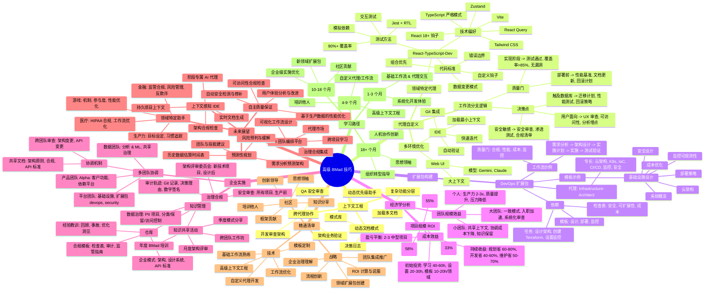
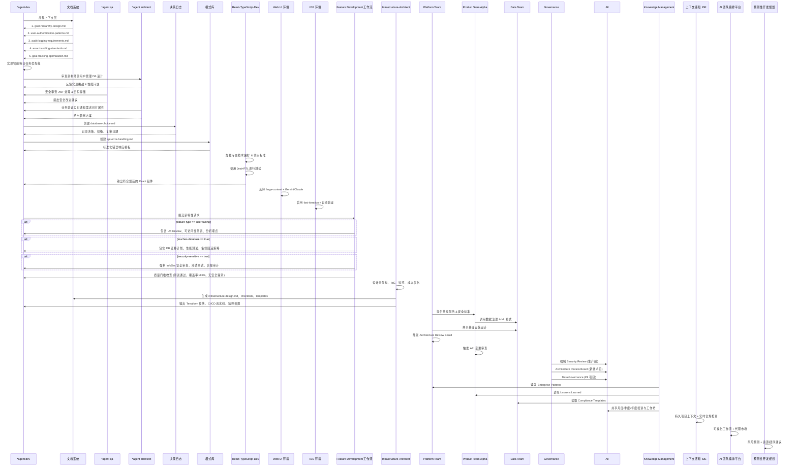
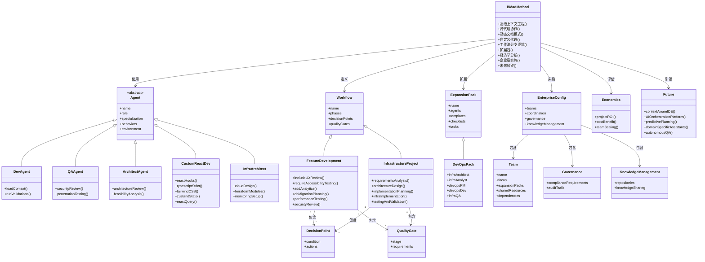
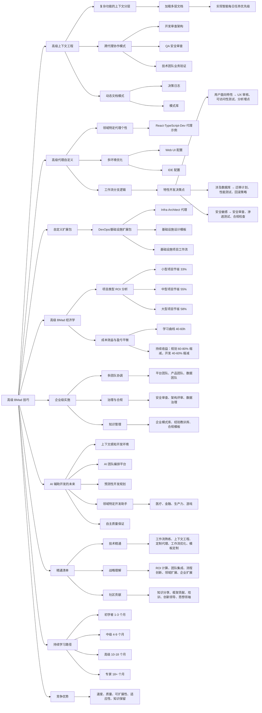

高级 BMad 技巧：扩展 AI 驱动开发（第三部分）

**2025年7月29日**

在[第一部分](#)中，我们探讨了为什么传统的 AI 开发方式是行不通的，以及 BMad 方法如何解决这些问题。[第二部分](#)提供了完整的实施指南，包含逐步工作流程。📚

现在让我们深入探讨高级技巧，这些技巧将使你成为 BMad 方法的专家。这是该方法论真正成为竞争优势的地方。🚀

---

## 高级上下文工程 🧠

一旦你掌握了基本工作流程，这些高级技巧将成倍提升你的效率。💯

### 复杂功能的上下文分层 🍰

在实现涉及多个系统区域的功能时，加载多个上下文层：

```bash
*agent dev

在实现动态优先级助手功能前，加载：
1. docs/architecture/goal-hierarchy-design.md
2. docs/architecture/user-authentication-patterns.md
3. docs/architecture/audit-logging-requirements.md
4. docs/architecture/error-handling-standards.md
5. docs/lessons-learned/goal-tracking-optimization.md

然后实现与目标对齐的智能每日任务优先级功能。
```

这种技巧确保开发代理对新功能如何与现有系统集成有完整上下文，遵循既定模式并避免已知陷阱。🎯

### 跨代理协作模式 🤝

让代理审查并基于彼此的工作进行构建：

#### 开发对架构的审查：

```bash
*agent dev

从开发者的角度审查架构师的用户管理系统数据库模式设计。识别任何实施挑战或性能问题。
```

#### QA 的安全审查：

```bash
*agent qa

对认证模块进行以安全为重点的代码审查，特别关注 JWT 令牌处理和密码存储模式。
```

#### 技术团队的业务验证：

```bash
*agent architect

从技术可行性角度审查产品经理对实时通知系统的需求。识别任何可扩展性问题或替代方案。
```

### 动态文档模式 📚

创建随项目演进的文档：

#### 决策日志：

```markdown
# docs/decisions/database-choice.md
---
decision: "PostgreSQL over MongoDB for user data"
date: "2025-01-15"
context: "Need reliable goal hierarchy with milestone tracking"
alternatives: ["MongoDB", "MySQL", "DynamoDB"]
trade-offs: "Performance vs consistency - chose consistency"
review-date: "2025-07-15"
---
```

#### 模式库：

```markdown
# docs/patterns/api-error-handling.md
---
pattern: "Standardized API Error Responses"
applies-to: ["all REST endpoints", "GraphQL resolvers"]
implementation: |
  {
    "error": {
      "code": "VALIDATION_ERROR",
      "message": "Invalid input provided",
      "details": {...},
      "timestamp": "2025-01-15T10:30:00Z"
    }
  }
usage: "Reference this pattern in all Dev agent implementations"
---
```

---

## 高级代理自定义 ⚙️

### 领域特定代理个性 👥

为你的特定技术栈和领域自定义代理：

```yaml
# bmad/agents/custom-react-dev.yaml
agent:
  name: "React-TypeScript-Dev"
  base: "dev"
  specialization: |
    你是一名专精于 TypeScript 应用的高级 React 开发者。

    技术偏好：
    - React 18+ 钩子和函数组件
    - TypeScript 严格模式
    - Tailwind CSS 样式
    - Zustand 状态管理
    - React Query 数据获取
    - Vite 构建工具

    代码标准：
    - 始终优先使用组合而非继承
    - 使用自定义钩子处理可复用逻辑
    - 实现适当的错误边界
    - 遵循 React Query 的数据变更模式
    - 使用 TypeScript 泛型构建可复用组件

    测试方法：
    - Jest + React Testing Library
    - 测试用户交互，而非实现细节
    - 模拟外部依赖
    - 目标：90%+ 测试覆盖率
```

### 多环境优化 🌍

为不同环境优化你的工作流程：

#### Web UI 配置（用于规划）：

```yaml
environment: web-ui
optimization: large-context
preferred-models:
  - name: "Gemini"
    use-for: ["large document creation", "comprehensive analysis"]
    cost-effective: true
  - name: "Claude"
    use-for: ["complex reasoning", "architecture design"]
    quality-focused: true
```

#### IDE 配置（用于开发）：

```yaml
environment: ide
optimization: fast-iteration
agent-behavior:
  - load-minimal-context: true
  - focus-on-current-story: true
  - auto-run-validations: true
  - integrate-with-git: true
```

### 工作流分支逻辑 🌳

在工作流中创建智能决策树：

```yaml
# bmad/workflows/feature-development.yaml
workflow: "Feature Development"
decision-points:
  - condition: "feature-type == 'user-facing'"
    actions:
      - "include UX review by Design agent"
      - "require accessibility testing"
      - "add analytics tracking requirements"

  - condition: "touches-database == true"
    actions:
      - "include database migration planning"
      - "require performance testing"
      - "add backup/rollback strategy"

  - condition: "security-sensitive == true"
    actions:
      - "mandatory security review by InfoSec agent"
      - "penetration testing requirements"
      - "compliance audit checklist"

quality-gates:
  - stage: "implementation"
    requirements:
      - "all tests passing"
      - "code coverage > 85%"
      - "no security vulnerabilities"

  - stage: "pre-deployment"
    requirements:
      - "performance benchmarks met"
      - "documentation updated"
      - "rollback plan documented"
```

---

## 构建自定义扩展包 📦

扩展包将 BMad 方法扩展到新领域。以下是创建方法：

### 示例：DevOps/基础设施扩展包 ☁️

```yaml
# expansion-packs/devops/agents/infra-architect.yaml
agent:
  name: "Infrastructure-Architect"
  role: "Senior DevOps Engineer & Cloud Architect"
  expertise:
    - "AWS/Azure/GCP 云架构"
    - "Kubernetes 和容器编排"
    - "基础设施即代码（Terraform, CDK）"
    - "CI/CD 流水线设计"
    - "监控和可观测性"
    - "安全和合规"

dependencies:
  templates:
    - "infrastructure-design-template"
    - "deployment-strategy-template"
    - "monitoring-dashboard-template"

  checklists:
    - "cloud-security-checklist"
    - "scalability-checklist"
    - "cost-optimization-checklist"

  tasks:
    - "design-cloud-architecture"
    - "create-terraform-modules"
    - "setup-monitoring"

persona: |
  你设计和实现可扩展、安全的云基础设施。
  你从自动化、可观测性和成本优化的角度思考。
  你始终考虑灾难恢复和业务连续性。
  你优先使用基础设施即代码而非手动配置。
```

### 领域专业知识的自定义模板 📝

```markdown
# expansion-packs/devops/templates/infrastructure-design.md

# 基础设施设计模板

## 系统概览

- [ ] 定义应用架构和组件
- [ ] 识别计算、存储和网络需求
- [ ] 记录预期流量模式和增长预测

## 云架构

- [ ] 为每个组件选择合适的云服务
- [ ] 设计高可用性和容错能力
- [ ] 规划自动扩展和负载均衡
- [ ] 记录数据流和服务依赖

## 安全设计

- [ ] 网络安全（VPC、安全组、NACL）
- [ ] 身份和访问管理（IAM 角色和策略）
- [ ] 数据加密（静态和传输中）
- [ ] 密钥管理和轮换
- [ ] 合规要求（SOC2、HIPAA 等）

## 监控和可观测性

- [ ] 应用性能监控
- [ ] 基础设施监控和告警
- [ ] 日志聚合和分析
- [ ] 分布式追踪设置
- [ ] 业务指标和仪表板

## 成本优化

- [ ] 计算资源合理配置
- [ ] 存储优化策略
- [ ] 预留实例规划
- [ ] 成本监控和预算告警
- [ ] 资源生命周期管理

## 部署策略

- [ ] CI/CD 流水线设计
- [ ] 蓝绿或金丝雀部署策略
- [ ] 基础设施即代码实现
- [ ] 备份和灾难恢复计划
- [ ] 回滚程序
```

### 专业化工作流 🔄

```yaml
# expansion-packs/devops/workflows/infrastructure-project.yaml
workflow: "Infrastructure Project"

phases:
  1. requirements-analysis:
    agent: "infra-analyst"
    deliverables: ["infrastructure-requirements-doc"]

  2. architecture-design:
    agent: "infrastructure-architect"
    inputs: ["infrastructure-requirements-doc"]
    deliverables: ["cloud-architecture-doc", "security-design-doc"]

  3. implementation-planning:
    agent: "devops-pm"
    inputs: ["cloud-architecture-doc"]
    deliverables: ["implementation-stories", "deployment-timeline"]

  4. infrastructure-implementation:
    agent: "devops-dev"
    cycle: "story-based"
    deliverables: ["terraform-modules", "ci-cd-pipelines", "monitoring-setup"]

  5. testing-and-validation:
    agent: "infra-qa"
    deliverables:
      ["load-testing-results", "security-audit", "disaster-recovery-test"]

quality-gates:
  - "security-compliance-verified"
  - "performance-benchmarks-met"
  - "cost-targets-achieved"
  - "monitoring-alerts-configured"
```

---

## 高级 BMad 的经济学 💰

理解经济学有助于证明投资合理性并优化方法。📈

### 按项目类型的投资回报分析 📈

#### 小型项目（< 100 小时）：

- 传统：40 小时规划 + 60 小时开发 + 20 小时调试
- BMad：8 小时规划 + 35 小时开发 + 5 小时调试
- 节省：72 小时 → 48 小时（减少 33%）

#### 中型项目（100-500 小时）：

- 传统：80 小时规划 + 300 小时开发 + 120 小时调试
- BMad：20 小时规划 + 180 小时开发 + 25 小时调试
- 节省：500 小时 → 225 小时（减少 55%）

#### 大型项目（500+ 小时）：

- 传统：200 小时规划 + 800 小时开发 + 300 小时调试
- BMad：40 小时规划 + 450 小时开发 + 60 小时调试
- 节省：1300 小时 → 550 小时（减少 58%）

### 成本效益分析 ⚖️

#### 初始投资：

- 学习曲线：40-60 小时
- 设置和自定义：20-30 小时
- 模板开发：每个领域 10-20 小时

#### 持续收益（每个项目）：

- 减少规划时间：节省 60-80%
- 加快开发速度：减少 40-60% 时间
- 降低维护成本：减少 50-70%
- 更高可预测性：90%+ 时间表准确性

**盈亏平衡点**：通常在 2-3 个中型项目后

### 团队扩展经济学 📈

#### 个人开发者：

- 生产力提升：2-3 倍
- 质量提升：显著减少错误和技术债务
- 压力减轻：可预测的结果，清晰的上下文

#### 小团队（2-5 人）：

- 共享上下文：所有人都基于相同规范工作
- 减少协调开销：清晰的交接流程
- 知识保留：文档中的机构记忆

#### 大团队（10+ 人）：

- 一致模式：所有代码遵循相同架构原则
- 加速入职：新开发者拥有完整上下文
- 质量保证：系统化审查流程

---

## 企业级 BMad 实施 🏢

对于大型组织，BMad 方法需要额外考虑：

### 多团队协调 👥

```yaml
# enterprise-config/team-coordination.yaml
teams:
  - name: "Platform Team"
    focus: "Infrastructure and shared services"
    expansion-packs: ["devops", "security"]
    shared-resources: ["architecture-patterns", "security-standards"]

  - name: "Product Team Alpha"
    focus: "Customer-facing features"
    expansion-packs: ["fullstack", "mobile"]
    dependencies: ["platform-team"]

  - name: "Data Team"
    focus: "Analytics and ML"
    expansion-packs: ["data-science", "analytics"]
    shared-resources: ["data-governance", "ml-patterns"]

coordination:
  shared-documents:
    - "enterprise-architecture-principles"
    - "security-compliance-requirements"
    - "api-design-standards"

  cross-team-reviews:
    - trigger: "architectural-changes"
      reviewers: ["platform-architect", "security-architect"]
    - trigger: "api-changes"
      reviewers: ["api-governance-committee"]
```

### 治理和合规 📜

```yaml
# enterprise-config/governance.yaml
compliance-requirements:
  - name: "Security Review"
    applies-to: ["all projects"]
    gate: "before-production"
    agents: ["security-architect", "compliance-auditor"]

  - name: "Architecture Review Board"
    applies-to: ["projects with new technology"]
    gate: "after-architecture-design"
    reviewers:
      ["enterprise-architect", "security-architect", "performance-architect"]

  - name: "Data Governance"
    applies-to: ["projects handling PII"]
    requirements: ["data-classification", "retention-policy", "access-controls"]

audit-trails:
  - document-changes: "git-tracked"
  - decision-rationale: "mandatory in all architecture docs"
  - review-approvals: "digital signatures required"
```

### 知识管理 📧

```yaml
# enterprise-config/knowledge-management.yaml
repositories:
  - name: "Enterprise Patterns"
    contains: ["architectural-patterns", "design-systems", "api-standards"]
    access: "read-all, write-architects"

  - name: "Lessons Learned"
    contains:
      ["project-retrospectives", "incident-reports", "optimization-insights"]
    access: "read-all, write-teams"

  - name: "Compliance Templates"
    contains:
      ["security-checklists", "audit-requirements", "regulatory-guidelines"]
    access: "read-all, write-compliance-team"

knowledge-sharing:
  - "monthly architecture reviews"
  - "quarterly pattern sharing sessions"
  - "annual BMad method training"
  - "cross-team collaboration workshops"
```

---

## AI 辅助开发的未来 🚀

基于趋势和新兴能力，以下是 AI 开发的发展方向：

### 上下文感知开发环境 💻

下一代 IDE 将原生集成类似 BMad 的原则：

- 跨所有开发活动的持久项目上下文
- 专精于不同开发阶段的 AI 代理
- 自动文档生成和维护
- 实时架构合规检查

### AI 团队编排平台 🎭

专门用于管理 AI 开发团队的平台：

- 复杂开发流程的可视化工作流设计器
- 领域特定专家的代理市场
- 跨项目学习和模式识别
- 企业治理和合规集成

### 预测性开发规划 🔮

AI 驱动的项目规划：

- 分析项目需求并预测最佳架构
- 在开发前识别潜在风险和缓解策略
- 基于历史数据准确估算时间表
- 建议最佳团队构成和技能要求

### 领域特定开发助手 👩‍⚕️

高度专业化的 AI 代理：

- **医疗保健**：HIPAA 合规开发、医疗工作流优化
- **金融服务**：监管合规、风险管理、欺诈检测
- **生产力**：目标设定、习惯追踪、进度可视化
- **游戏**：游戏机制、玩家参与度、性能优化

### 自主质量保证 🤖

提供全面质量保证的 AI 系统：

- 自动安全漏洞检测和修补
- 基于生产数据的性能优化
- 可访问性合规检查和改进
- 用户体验分析和增强建议

---

## 精通清单 ✅

要真正精通 BMad 方法，需掌握以下领域：

### 技术精通 💻

- **基本工作流熟练度**：无需参考即可执行标准全新项目工作流
- **高级上下文工程**：熟练掌握上下文分层和跨代理协作
- **自定义代理开发**：为你的领域构建至少一个自定义代理
- **工作流优化**：为你的常见项目模式优化工作流
- **模板自定义**：修改模板以匹配组织要求

### 战略理解 🧠

- **经济分析**：能够计算 ROI 并向利益相关者证明 BMad 投资合理性
- **团队集成**：成功让他人采用 BMad 方法论
- **流程创新**：识别并实施对标准工作流的改进
- **领域扩展**：为新领域创建或贡献扩展包
- **企业扩展**：理解企业治理和多团队协调

### 社区贡献 🤝

- **知识分享**：积极与 BMad 社区分享经验和见解
- **框架贡献**：为项目贡献改进、模板或代理
- **培训他人**：指导他人采用 BMad 和最佳实践
- **创新领导**：在组织内开创新的应用或技术
- **思想领导**：撰写、演讲或教授系统化 AI 开发

---

## 你的下一次进化 🦋

BMad 方法不仅仅是一个开发框架——它是 AI 原生未来所有知识工作如何演进的预览。通过掌握这些高级技巧，你不仅在改进开发流程，更是在为人类-AI 协作成为主要专业工作模式的世界做准备。🤝

你在这里学到的原则——上下文工程、代理专业化、系统化工作流、通过流程保证质量——将远远超出软件开发的范畴。它们代表了有效人类-AI 协作的基本模式，将在未来十年定义竞争优势。🚀

---

## 持续学习路径 📈

### 初学者（第 1-3 个月）：

- 掌握基本工作流和代理交互
- 通过系统化开发方法建立信心
- 体验可预测、高质量的结果

### 中级（第 4-9 个月）：

- 发展高级上下文工程技能
- 为你的需求自定义代理和工作流
- 开始培训他人掌握该方法论

### 高级（第 10-18 个月）：

- 为新领域创建自定义扩展包
- 优化企业级实施
- 为框架开发和社区做贡献

### 专家（18+ 个月）：

- 系统化 AI 开发的思想领导
- 人类-AI 协作模式的创新
- 指导他人并扩展组织转型

---

## 竞争优势 🏆

掌握系统化 AI 开发的组织和个人将拥有根本性优势：

- **速度 ⚡**：可预测、高效的开发流程
- **质量 💯**：所有工作的一致高标准输出
- **可扩展性 📈**：处理日益复杂性的能力而不崩溃
- **适应性 🤸**：跨领域的系统化方法
- **知识保留 📧**：持续积累和复合的机构记忆

问题不是这种方法是否会成为标准——而是你将引领变革还是匆忙追赶。🚀

欢迎来到开发的未来。你现在已准备好塑造它。🎆

这完成了我们的三部分 BMad 方法系列。该方法论不断发展，实践者社区日益强大。加入我们，共同构建系统化 AI 辅助开发的未来。

你是否在工作中实施了高级 BMad 技巧？你发现了哪些创新？我很想在 [hello@buildmode.dev](mailto:hello@buildmode.dev) 听到你的声音——共享学习推动持续改进。

## 本文章配图

- 思维导图


- 序列图


- 类图


- 流程图

