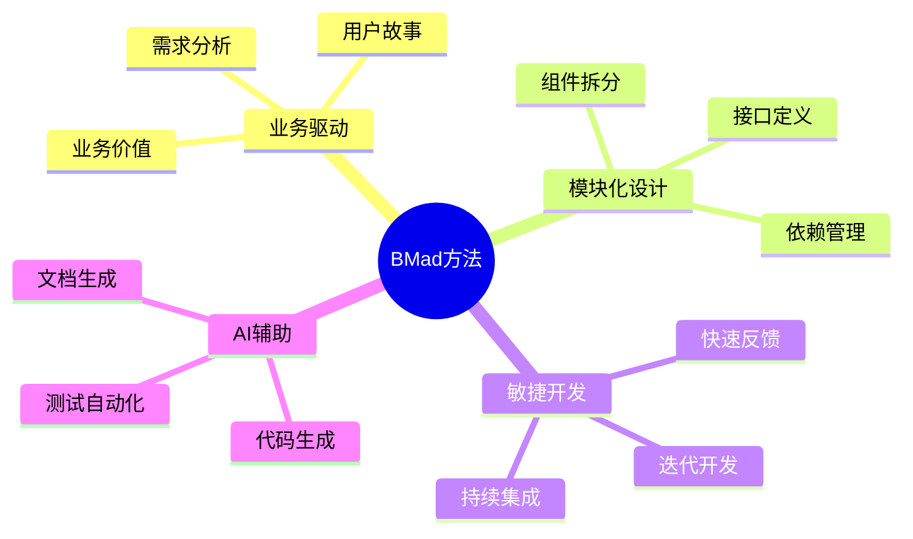
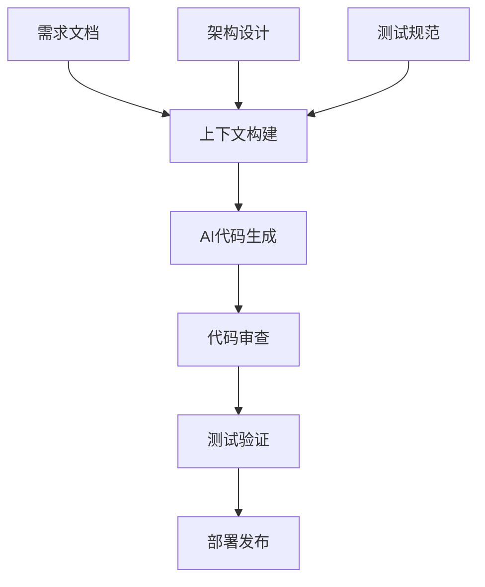
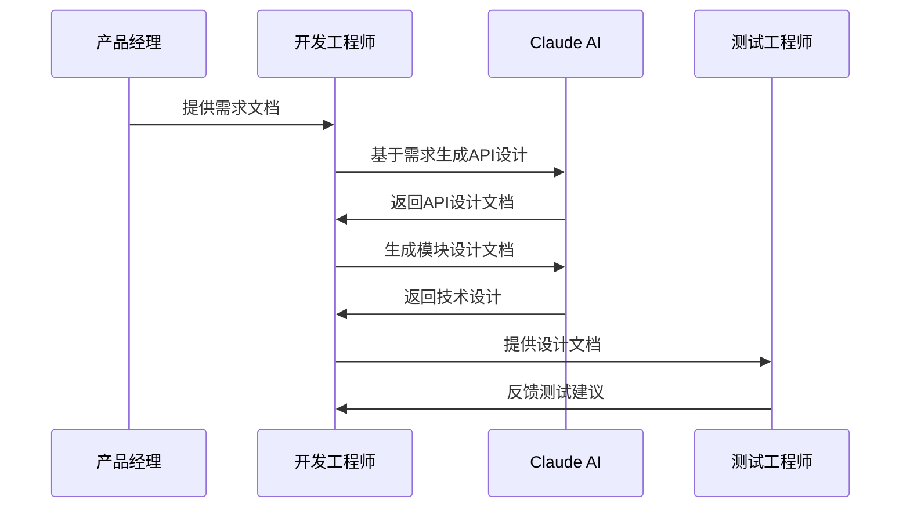
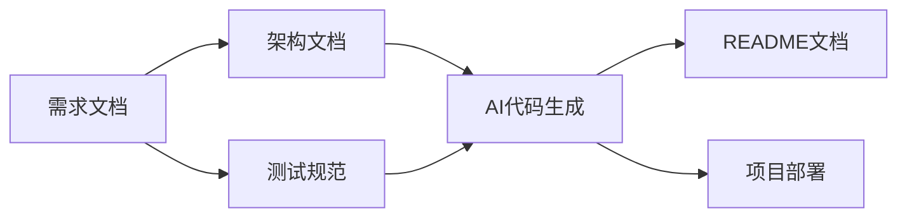
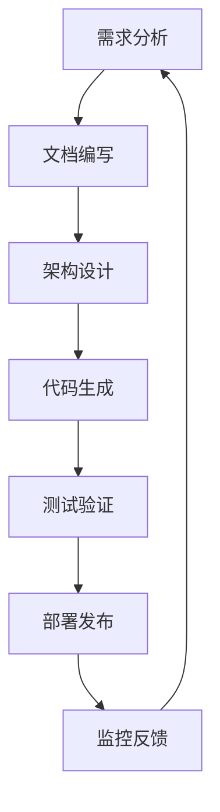

# Claude Code开发思路文档

## 概述

本文档详细介绍了基于Claude AI的敏捷开发方法论，包括BMad方法、文档驱动开发、测试驱动开发等核心理念，以及完整的项目开发流程和常用提示词集合。

## 核心方法论

### BMad方法 - 敏捷AI驱动开发的突破方法

BMad（Business-driven, Modular, Agile development）方法是一种创新的AI驱动开发方法论，专门为现代软件开发团队设计。



#### BMad方法的三个核心阶段

| 阶段 | 主要活动 | 产出物 | AI辅助程度 |
|------|----------|--------|------------|
| 第一阶段 | 需求分析、架构设计 | 需求文档、架构文档 | 高 |
| 第二阶段 | 代码实现、单元测试 | 源代码、测试用例 | 极高 |
| 第三阶段 | 集成测试、部署优化 | 部署脚本、文档 | 中 |

### AI辅助软件开发 - 上下文就是一切

在AI辅助开发中，上下文信息的质量直接决定了AI生成代码的准确性和可用性。



## 开发方法实例

### 文档驱动开发示例

文档驱动开发（Document-Driven Development）强调在编码之前先完善文档，确保开发方向明确。

#### 核心文档模板

| 文档类型 | 文件名 | 用途 | 重要程度 |
|----------|--------|------|----------|
| API接口设计 | api-design.md | 定义接口规范 | ⭐⭐⭐⭐⭐ |
| 功能模块技术设计 | module-design.md | 模块架构设计 | ⭐⭐⭐⭐ |
| 用户管理模块 | 01-user-management.pdf | 具体功能实现 | ⭐⭐⭐ |



### 测试驱动开发示例

测试驱动开发（Test-Driven Development）通过先写测试用例，再编写实现代码的方式，确保代码质量。

#### 核心文件结构

```
project/
├── CLAUDE.md          # AI开发配置文件
├── approve.md         # 需求文档
├── design.md          # 架构设计文档
├── 技术文档写作规范.md    # 技术文档写作规范
└── src/              # 源代码目录
```

## Claude Code开发方法论

### 简化版开发流程



#### 三文档开发模式

| 序号 | 文档名称 | 作用 | 生成方式 |
|------|----------|------|----------|
| 1 | 需求文档 | 明确功能要求 | 手动编写 |
| 2 | 架构文档 | 定义技术实现 | AI辅助生成 |
| 3 | 测试规范 | 确保代码质量 | AI辅助生成 |

## 详细操作步骤

### 步骤0：根据你的初始需求，生成较为专业的需求书。

#### 输入要求
- **输入文件**：CLAUDE.md
- **执行命令**：
```bash
【此处说明你的需求】
请你用专业的角度来分析，并且问我问题来补充完善这个需求。直到我们互相都满意为止
你还有哪些条件需要确认，以及需要增加、补充哪些信息。
```
整理需求内容，保存为`approve.md`。

### 步骤1：生成项目配置文件

#### 输入要求
- **输入文件**：`approve.md`（需求文档）
- **执行命令**：
```bash
/init
```

#### 输出结果
- **产出文件**：`CLAUDE.md`（AI开发配置文档）

CLAUDE.md文件会有一个更新操作，自动添加了项目相关的内容。

### 步骤2：生成架构设计文档

#### 输入要求
- **输入文件**：`CLAUDE.md`（项目配置）+ `approve.md`（需求文档）
- **提示词**：
```
请你根据目录下的需求文件:"approve.md"，按照“技术文档写作规范.md”规定的格式，生成可执行的架构设计文档:"design.md"。
```

#### 输出结果
- **产出文件**：`design.md`（架构设计文档）

#### 架构设计文档包含内容

| 章节 | 内容 | 重要程度 |
|------|------|----------|
| 系统架构 | 整体架构设计 | ⭐⭐⭐⭐⭐ |
| 模块划分 | 功能模块定义 | ⭐⭐⭐⭐ |
| API接口 | 接口规范定义 | ⭐⭐⭐⭐⭐ |
| 数据库设计 | 数据模型设计 | ⭐⭐⭐⭐ |
| 部署方案 | 部署策略 | ⭐⭐⭐ |

### 步骤3：代码生成与项目构建

#### 输入要求
- **输入文件**：`CLAUDE.md` + `design.md`
- **提示词**：
```
现在，请你严格按照架构设计文件:"design.md"开始编写代码。
```

#### 输出结果
- **产出内容**：
  - 完整的项目代码
  - `README.md`文件
  - 部署脚本

### 步骤4：代码测试与验证

#### 输入要求
- **提示词**：
```
请你按照设计文件:"design.md"和"CLAUDE.md"中的'代码测试规范'对所有代码进行单元测试和集成测试，并解决本次测试中发现的问题，做好测试记录。
```

#### 测试类型

| 测试类型 | 测试范围 | 自动化程度 | 重要程度 |
|----------|----------|------------|----------|
| 单元测试 | 函数/方法级 | 高 | ⭐⭐⭐⭐⭐ |
| 集成测试 | 模块间交互 | 中 | ⭐⭐⭐⭐ |
| API测试 | 接口功能 | 高 | ⭐⭐⭐⭐⭐ |
| 端到端测试 | 完整流程 | 中 | ⭐⭐⭐ |

## 常用提示词库

### API接口管理提示词

```
注意：API接口不要轻易更改。保持API接口和设计文档："design.md"的一致性。前端和后端，那个错了改那个，请检查。
```

### 一致性检查提示词

```
确认前面的所有修改和"design.md"的一致性。如果以前"design.md"定义模糊的地方，请更新到设计文档。确保文档把前端和后端的API接口定义的清楚和明白。
```

## 最佳实践建议

### 开发流程优化



### 质量控制要点

| 控制点 | 检查内容 | 负责人 | 频率 |
|--------|----------|--------|------|
| 需求评审 | 需求完整性、可行性 | 产品经理 | 每个迭代开始 |
| 架构评审 | 技术方案合理性 | 架构师 | 设计完成后 |
| 代码审查 | 代码质量、规范性 | 开发工程师 | 每次提交 |
| 测试验证 | 功能正确性 | 测试工程师 | 持续进行 |

## 总结

Claude Code开发方法论通过结合BMad方法、文档驱动开发和测试驱动开发，为AI辅助软件开发提供了一套完整的解决方案。该方法论强调：

1. **文档先行**：通过完善的文档体系确保开发方向明确
2. **AI辅助**：充分利用AI能力提高开发效率
3. **质量保证**：通过测试驱动确保代码质量
4. **持续优化**：通过反馈机制持续改进开发流程

通过遵循这套方法论，开发团队可以显著提高开发效率，减少错误，并保证项目的高质量交付。
