# 用户认证模块 技术设计文档

## 执行摘要

本文档设计了一个高性能、安全的用户认证模块，支持JWT令牌认证、细粒度权限控制和多语言实现。该模块解决了现有系统认证性能瓶颈和安全漏洞问题，预计可提升认证响应速度50%，支持10000+ QPS并发访问。

核心价值：统一认证标准、增强系统安全、提升用户体验、支持横向扩展。设计采用无状态JWT架构，结合Redis缓存和防暴力破解机制，确保高可用性和安全性。

预期影响：为整个平台提供统一的身份认证基础设施，支持未来业务快速增长和多元化场景需求。

## 1. 问题陈述

### 1.1 现状与挑战
- **性能瓶颈**：现有认证系统响应时间达200ms+，无法满足高并发需求
- **安全隐患**：缺乏防暴力破解、会话管理不完善、权限控制粗放
- **技术债务**：多套认证系统并存，维护成本高，缺乏统一标准
- **扩展困难**：无法支持SSO、多语言集成复杂度高

### 1.2 业务需求
- 支持日均千万级用户认证请求
- 提供细粒度的权限控制能力
- 满足安全合规要求
- 支持多种登录方式和第三方集成

### 1.3 目标与非目标

**目标**：
- 认证响应时间 < 100ms（P95）
- 支持并发 > 10000 QPS
- 安全漏洞零容忍
- 支持5种主流编程语言实现
- 99.9%系统可用性

**成功指标**：
- 认证成功率 > 99.5%
- 系统响应时间提升50%
- 安全事件减少90%
- 开发集成时间缩短60%

**非目标**：
- 不解决用户注册和密码找回
- 不提供用户画像和行为分析
- 不包含前端UI组件
- 不处理第三方OAuth服务端实现

## 2. 架构决策记录

### ADR-001: 采用JWT无状态架构
**决策**：使用JWT令牌替代传统Session机制  
**原因**：支持分布式部署、减少服务器存储压力、便于微服务集成  
**后果**：令牌较大、无法即时撤销、需要黑名单机制补充  

### ADR-002: 选择bcrypt密码加密
**决策**：使用bcrypt进行密码哈希存储  
**原因**：内建盐值、可调节复杂度、抗彩虹表攻击  
**后果**：计算开销较大，需要合理设置cost参数  

### ADR-003: Redis缓存会话信息
**决策**：使用Redis缓存用户会话和权限信息  
**原因**：高性能、支持TTL、数据结构丰富  
**后果**：增加外部依赖、需要考虑缓存一致性  

### ADR-004: 技术选型对比

| 技术组件 | 选择方案 | 替代方案 | 选择理由 |
|---------|---------|---------|---------|
| 令牌技术 | JWT | Session Cookie | 无状态、跨域支持、微服务友好 |
| 密码加密 | bcrypt | scrypt/argon2 | 成熟稳定、调节计算复杂度、广泛支持 |
| 缓存方案 | Redis | Memcached | 数据结构丰富、持久化、高可用 |
| 签名算法 | HMAC-SHA256 | RSA256 | 性能优势、密钥管理简单 |

## 3. 模块概述
### 3.1 模块定位
- **所属子系统**：用户管理子系统
- **模块职责**：负责用户身份认证、权限验证、会话管理
- **依赖模块**：数据库模块、缓存模块、日志模块
- **被依赖模块**：API网关、业务服务模块

### 3.2 功能概要
- **主要功能**：用户登录认证、JWT令牌生成与验证、权限检查、会话管理
- **输入**：用户凭证（用户名/密码、令牌）、权限验证请求
- **输出**：认证结果、访问令牌、用户权限信息
- **性能指标**：认证响应时间 < 100ms，支持并发请求 > 10000 QPS

## 4. 设计方案
### 4.1 总体架构
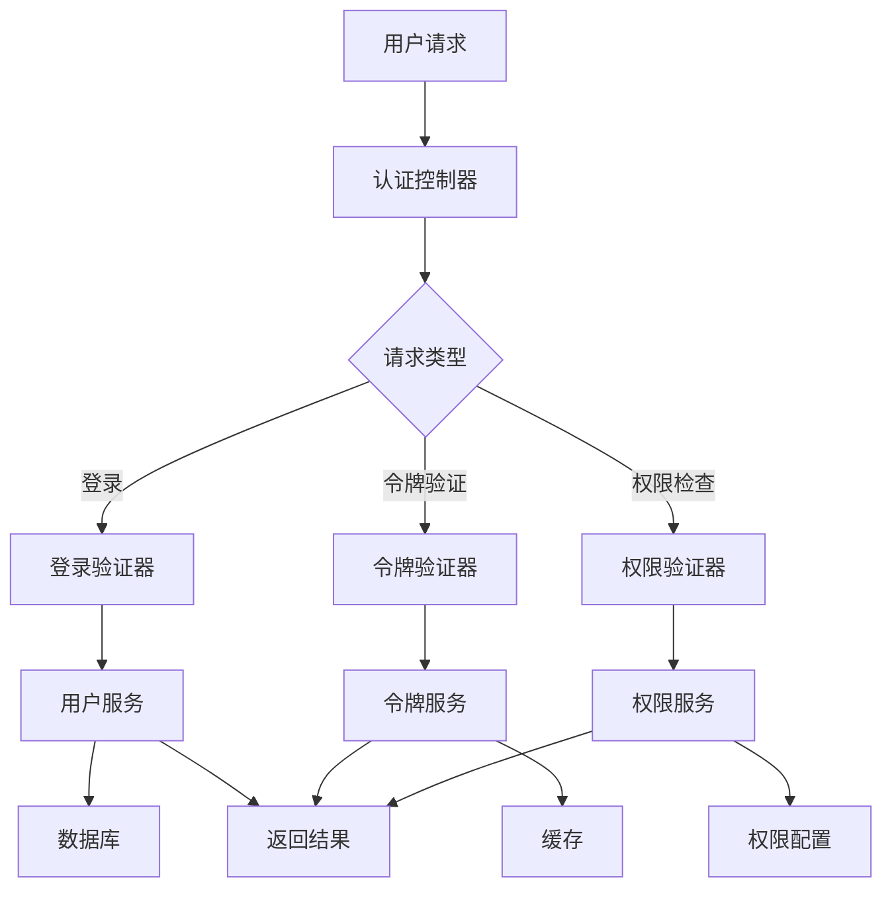

### 4.2 数据结构设计
#### 核心数据模型

**请求响应结构体**:
```go
// 用户认证请求
type AuthRequest struct {
    Username  string `json:"username" validate:"required"`
    Password  string `json:"password" validate:"required"`
    LoginType string `json:"login_type"` // password, token, sso
}

// 认证响应
type AuthResponse struct {
    Success      bool     `json:"success"`
    AccessToken  string   `json:"access_token,omitempty"`
    RefreshToken string   `json:"refresh_token,omitempty"`
    ExpiresIn    int64    `json:"expires_in,omitempty"`
    UserInfo     UserInfo `json:"user_info,omitempty"`
    ErrorCode    string   `json:"error_code,omitempty"`
    ErrorMsg     string   `json:"error_msg,omitempty"`
}
```

**用户相关结构体**:
```go
// 用户信息
type UserInfo struct {
    ID          int64    `json:"id"`
    Username    string   `json:"username"`
    Email       string   `json:"email"`
    Roles       []string `json:"roles"`
    Permissions []string `json:"permissions"`
}

// 用户实体
type User struct {
    ID           int64     `db:"id"`
    Username     string    `db:"username"`
    Email        string    `db:"email"`
    PasswordHash string    `db:"password_hash"`
    IsActive     bool      `db:"is_active"`
    Roles        []string  `db:"roles"`
    Permissions  []string  `db:"permissions"`
    CreatedAt    time.Time `db:"created_at"`
    UpdatedAt    time.Time `db:"updated_at"`
    LastLoginAt  time.Time `db:"last_login_at"`
}
```

**令牌相关结构体**:
```go
// JWT令牌声明
type TokenClaims struct {
    UserID    int64    `json:"user_id"`
    Username  string   `json:"username"`
    Roles     []string `json:"roles"`
    IssuedAt  int64    `json:"iat"`
    ExpiresAt int64    `json:"exp"`
}

// 刷新令牌数据
type RefreshTokenData struct {
    UserID    int64     `json:"user_id"`
    Token     string    `json:"token"`
    ExpiresAt time.Time `json:"expires_at"`
    CreatedAt time.Time `json:"created_at"`
}

// 会话数据
type SessionData struct {
    UserID      int64     `json:"user_id"`
    Username    string    `json:"username"`
    Roles       []string  `json:"roles"`
    LoginTime   time.Time `json:"login_time"`
    RefreshTime time.Time `json:"refresh_time,omitempty"`
}
```

**权限相关结构体**:
```go
// 用户权限信息
type UserPermissions struct {
    UserID      int64        `json:"user_id"`
    Roles       []Role       `json:"roles"`
    Permissions []Permission `json:"permissions"`
}

// 角色
type Role struct {
    ID          int64    `json:"id"`
    Name        string   `json:"name"`
    Description string   `json:"description"`
    Permissions []string `json:"permissions"`
}

// 权限
type Permission struct {
    ID       int64  `json:"id"`
    Resource string `json:"resource"`
    Action   string `json:"action"`
    Allowed  bool   `json:"allowed"`
}
```

**配置相关结构体**:
```go
// 认证配置
type AuthConfig struct {
    JWT      JWTConfig      `yaml:"jwt"`
    Security SecurityConfig `yaml:"security"`
    Cache    CacheConfig    `yaml:"cache"`
}

// JWT配置
type JWTConfig struct {
    Secret             string        `yaml:"secret"`
    Issuer             string        `yaml:"issuer"`
    Audience           string        `yaml:"audience"`
    AccessTokenExpire  time.Duration `yaml:"access_token_expire"`
    RefreshTokenExpire time.Duration `yaml:"refresh_token_expire"`
}

// 安全配置
type SecurityConfig struct {
    MaxLoginAttempts       int           `yaml:"max_login_attempts"`
    LockoutDuration        time.Duration `yaml:"lockout_duration"`
    BcryptCost            int           `yaml:"bcrypt_cost"`
    ValidateUserStatus    bool          `yaml:"validate_user_status"`
    RefreshTokenRotation  bool          `yaml:"refresh_token_rotation"`
}

// 缓存配置
type CacheConfig struct {
    SessionExpire           time.Duration `yaml:"session_expire"`
    PermissionCacheExpire   time.Duration `yaml:"permission_cache_expire"`
}
```

#### 常量定义

**错误码常量**:
```go
const (
    // 参数相关错误
    INVALID_PARAMS = "INVALID_PARAMS"
    
    // 认证相关错误
    USER_NOT_FOUND      = "USER_NOT_FOUND"
    INVALID_PASSWORD    = "INVALID_PASSWORD"
    ACCOUNT_DISABLED    = "ACCOUNT_DISABLED"
    ACCOUNT_LOCKED      = "ACCOUNT_LOCKED"
    
    // 令牌相关错误
    INVALID_TOKEN         = "INVALID_TOKEN"
    TOKEN_EXPIRED         = "TOKEN_EXPIRED"
    TOKEN_BLACKLISTED     = "TOKEN_BLACKLISTED"
    TOKEN_PARSE_ERROR     = "TOKEN_PARSE_ERROR"
    INVALID_REFRESH_TOKEN = "INVALID_REFRESH_TOKEN"
    REFRESH_TOKEN_USED    = "REFRESH_TOKEN_USED"
    
    // 权限相关错误
    PERMISSION_DENIED = "PERMISSION_DENIED"
    USER_INVALID      = "USER_INVALID"
)
```

**HTTP状态码常量**:
```go
const (
    StatusOK                  = 200 // 操作成功
    StatusBadRequest          = 400 // 请求参数错误
    StatusUnauthorized        = 401 // 身份验证失败
    StatusForbidden           = 403 // 权限不足
    StatusLocked              = 423 // 账户被锁定
    StatusInternalServerError = 500 // 服务器内部错误
)
```

**缓存键常量**:
```go
const (
    // 会话相关
    SessionKeyPrefix = "session:"
    
    // 登录尝试相关
    LoginAttemptsKeyPrefix = "login_attempts:"
    
    // 令牌黑名单相关
    TokenBlacklistKeyPrefix = "blacklist:token:"
    
    // 刷新令牌使用记录
    RefreshTokenUsedKeyPrefix = "refresh_token:used:"
    
    // 用户权限缓存
    UserPermissionsKeyPrefix = "user:permissions:"
)
```

**业务常量**:
```go
const (
    // 登录类型
    LoginTypePassword = "password"
    LoginTypeToken    = "token"
    LoginTypeSSO      = "sso"
    
    // 权限动作
    ActionRead   = "read"
    ActionWrite  = "write"
    ActionDelete = "delete"
    ActionAdmin  = "admin"
    
    // 默认配置值
    DefaultBcryptCost        = 12
    DefaultMaxLoginAttempts  = 5
    DefaultLockoutDuration   = 15 * time.Minute
    DefaultAccessTokenExpire = 1 * time.Hour
    DefaultRefreshTokenExpire = 7 * 24 * time.Hour
)
```

#### 数据库表设计

**符合第三范式的数据库设计**：

**用户表（users）**:
```sql
CREATE TABLE users (
    id BIGINT PRIMARY KEY AUTO_INCREMENT,
    username VARCHAR(50) UNIQUE NOT NULL COMMENT '用户名',
    email VARCHAR(255) UNIQUE NOT NULL COMMENT '邮箱',
    password_hash VARCHAR(255) NOT NULL COMMENT '密码哈希',
    is_active BOOLEAN DEFAULT TRUE COMMENT '是否激活',
    created_at TIMESTAMP DEFAULT CURRENT_TIMESTAMP COMMENT '创建时间',
    updated_at TIMESTAMP DEFAULT CURRENT_TIMESTAMP ON UPDATE CURRENT_TIMESTAMP COMMENT '更新时间',
    last_login_at TIMESTAMP NULL COMMENT '最后登录时间',
    INDEX idx_username (username),
    INDEX idx_email (email),
    INDEX idx_last_login (last_login_at)
) COMMENT '用户基础信息表';
```

**角色表（roles）**:
```sql
CREATE TABLE roles (
    id BIGINT PRIMARY KEY AUTO_INCREMENT,
    name VARCHAR(50) UNIQUE NOT NULL COMMENT '角色名称',
    description TEXT COMMENT '角色描述',
    is_system BOOLEAN DEFAULT FALSE COMMENT '是否为系统角色',
    created_at TIMESTAMP DEFAULT CURRENT_TIMESTAMP COMMENT '创建时间',
    updated_at TIMESTAMP DEFAULT CURRENT_TIMESTAMP ON UPDATE CURRENT_TIMESTAMP COMMENT '更新时间',
    INDEX idx_name (name)
) COMMENT '角色表';
```

**权限表（permissions）**:
```sql
CREATE TABLE permissions (
    id BIGINT PRIMARY KEY AUTO_INCREMENT,
    resource VARCHAR(100) NOT NULL COMMENT '资源名称',
    action VARCHAR(50) NOT NULL COMMENT '操作类型',
    description TEXT COMMENT '权限描述',
    created_at TIMESTAMP DEFAULT CURRENT_TIMESTAMP COMMENT '创建时间',
    UNIQUE KEY uk_resource_action (resource, action),
    INDEX idx_resource (resource)
) COMMENT '权限表';
```

**用户角色关联表（user_roles）**:
```sql
CREATE TABLE user_roles (
    id BIGINT PRIMARY KEY AUTO_INCREMENT,
    user_id BIGINT NOT NULL COMMENT '用户ID',
    role_id BIGINT NOT NULL COMMENT '角色ID',
    granted_by BIGINT NOT NULL COMMENT '授权人ID',
    granted_at TIMESTAMP DEFAULT CURRENT_TIMESTAMP COMMENT '授权时间',
    expires_at TIMESTAMP NULL COMMENT '过期时间',
    UNIQUE KEY uk_user_role (user_id, role_id),
    INDEX idx_user_id (user_id),
    INDEX idx_role_id (role_id),
    INDEX idx_expires_at (expires_at),
    FOREIGN KEY (user_id) REFERENCES users(id) ON DELETE CASCADE,
    FOREIGN KEY (role_id) REFERENCES roles(id) ON DELETE CASCADE,
    FOREIGN KEY (granted_by) REFERENCES users(id)
) COMMENT '用户角色关联表';
```

**角色权限关联表（role_permissions）**:
```sql
CREATE TABLE role_permissions (
    id BIGINT PRIMARY KEY AUTO_INCREMENT,
    role_id BIGINT NOT NULL COMMENT '角色ID',
    permission_id BIGINT NOT NULL COMMENT '权限ID',
    granted_by BIGINT NOT NULL COMMENT '授权人ID',
    granted_at TIMESTAMP DEFAULT CURRENT_TIMESTAMP COMMENT '授权时间',
    UNIQUE KEY uk_role_permission (role_id, permission_id),
    INDEX idx_role_id (role_id),
    INDEX idx_permission_id (permission_id),
    FOREIGN KEY (role_id) REFERENCES roles(id) ON DELETE CASCADE,
    FOREIGN KEY (permission_id) REFERENCES permissions(id) ON DELETE CASCADE,
    FOREIGN KEY (granted_by) REFERENCES users(id)
) COMMENT '角色权限关联表';
```

**用户直接权限表（user_permissions）**:
```sql
CREATE TABLE user_permissions (
    id BIGINT PRIMARY KEY AUTO_INCREMENT,
    user_id BIGINT NOT NULL COMMENT '用户ID',
    permission_id BIGINT NOT NULL COMMENT '权限ID',
    is_granted BOOLEAN DEFAULT TRUE COMMENT '是否授予权限',
    granted_by BIGINT NOT NULL COMMENT '授权人ID',
    granted_at TIMESTAMP DEFAULT CURRENT_TIMESTAMP COMMENT '授权时间',
    expires_at TIMESTAMP NULL COMMENT '过期时间',
    UNIQUE KEY uk_user_permission (user_id, permission_id),
    INDEX idx_user_id (user_id),
    INDEX idx_permission_id (permission_id),
    INDEX idx_expires_at (expires_at),
    FOREIGN KEY (user_id) REFERENCES users(id) ON DELETE CASCADE,
    FOREIGN KEY (permission_id) REFERENCES permissions(id) ON DELETE CASCADE,
    FOREIGN KEY (granted_by) REFERENCES users(id)
) COMMENT '用户直接权限表';
```

**刷新令牌表（refresh_tokens）**:
```sql
CREATE TABLE refresh_tokens (
    id BIGINT PRIMARY KEY AUTO_INCREMENT,
    user_id BIGINT NOT NULL COMMENT '用户ID',
    token_hash VARCHAR(255) NOT NULL COMMENT '令牌哈希值',
    expires_at TIMESTAMP NOT NULL COMMENT '过期时间',
    created_at TIMESTAMP DEFAULT CURRENT_TIMESTAMP COMMENT '创建时间',
    used_at TIMESTAMP NULL COMMENT '使用时间',
    revoked_at TIMESTAMP NULL COMMENT '撤销时间',
    client_ip VARCHAR(45) COMMENT '客户端IP',
    user_agent TEXT COMMENT '用户代理',
    UNIQUE KEY uk_token_hash (token_hash),
    INDEX idx_user_id (user_id),
    INDEX idx_expires_at (expires_at),
    INDEX idx_used_at (used_at),
    FOREIGN KEY (user_id) REFERENCES users(id) ON DELETE CASCADE
) COMMENT '刷新令牌表';
```

**登录日志表（login_logs）**:
```sql
CREATE TABLE login_logs (
    id BIGINT PRIMARY KEY AUTO_INCREMENT,
    user_id BIGINT NULL COMMENT '用户ID',
    username VARCHAR(50) COMMENT '用户名',
    login_result ENUM('SUCCESS', 'FAILED', 'BLOCKED') NOT NULL COMMENT '登录结果',
    failure_reason VARCHAR(50) COMMENT '失败原因',
    client_ip VARCHAR(45) COMMENT '客户端IP',
    user_agent TEXT COMMENT '用户代理',
    login_at TIMESTAMP DEFAULT CURRENT_TIMESTAMP COMMENT '登录时间',
    INDEX idx_user_id (user_id),
    INDEX idx_username (username),
    INDEX idx_login_result (login_result),
    INDEX idx_login_at (login_at),
    INDEX idx_client_ip (client_ip),
    FOREIGN KEY (user_id) REFERENCES users(id) ON DELETE SET NULL
) COMMENT '登录日志表';
```

**权限检查日志表（permission_logs）**:
```sql
CREATE TABLE permission_logs (
    id BIGINT PRIMARY KEY AUTO_INCREMENT,
    user_id BIGINT NOT NULL COMMENT '用户ID',
    resource VARCHAR(100) NOT NULL COMMENT '资源名称',
    action VARCHAR(50) NOT NULL COMMENT '操作类型',
    result ENUM('GRANTED', 'DENIED') NOT NULL COMMENT '检查结果',
    check_method ENUM('DIRECT', 'ROLE', 'WILDCARD') COMMENT '权限来源',
    client_ip VARCHAR(45) COMMENT '客户端IP',
    checked_at TIMESTAMP DEFAULT CURRENT_TIMESTAMP COMMENT '检查时间',
    INDEX idx_user_id (user_id),
    INDEX idx_resource_action (resource, action),
    INDEX idx_result (result),
    INDEX idx_checked_at (checked_at),
    FOREIGN KEY (user_id) REFERENCES users(id) ON DELETE CASCADE
) COMMENT '权限检查日志表';
```

#### 三范式符合性分析

**第一范式（1NF）**：
- 所有表的每个字段都是原子性的，不可再分
- 每个字段只包含一个值，没有重复组

**第二范式（2NF）**：
- 所有非主键字段都完全依赖于主键
- 消除了部分函数依赖，如用户角色和角色权限分别独立存储

**第三范式（3NF）**：
- 消除了传递依赖
- 用户的权限通过user_roles→role_permissions链式关联，避免冗余
- 权限信息（resource, action）独立存储在permissions表中

#### 表关系图
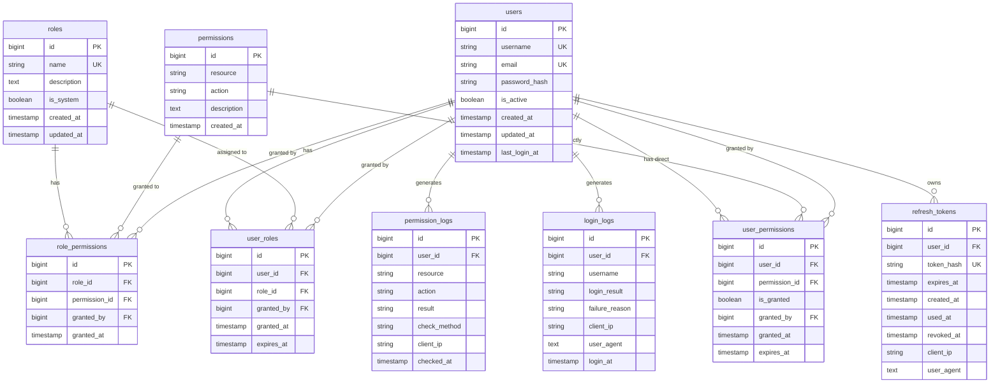

#### 常用查询示例

**获取用户完整权限（含角色权限）**：
```sql
-- 获取用户的所有有效权限
SELECT DISTINCT p.resource, p.action, 'role' as source
FROM users u
JOIN user_roles ur ON u.id = ur.user_id 
JOIN role_permissions rp ON ur.role_id = rp.role_id
JOIN permissions p ON rp.permission_id = p.id
WHERE u.id = ? 
  AND u.is_active = TRUE
  AND (ur.expires_at IS NULL OR ur.expires_at > NOW())

UNION

SELECT p.resource, p.action, 'direct' as source  
FROM users u
JOIN user_permissions up ON u.id = up.user_id
JOIN permissions p ON up.permission_id = p.id  
WHERE u.id = ?
  AND u.is_active = TRUE
  AND up.is_granted = TRUE
  AND (up.expires_at IS NULL OR up.expires_at > NOW());
```

**检查特定权限**：
```sql
-- 检查用户是否有特定资源的操作权限
SELECT 1 as has_permission
FROM users u
WHERE u.id = ? AND u.is_active = TRUE
  AND (
    -- 通过角色权限
    EXISTS (
      SELECT 1 FROM user_roles ur
      JOIN role_permissions rp ON ur.role_id = rp.role_id  
      JOIN permissions p ON rp.permission_id = p.id
      WHERE ur.user_id = u.id
        AND p.resource = ? AND p.action = ?
        AND (ur.expires_at IS NULL OR ur.expires_at > NOW())
    )
    OR
    -- 通过直接权限
    EXISTS (
      SELECT 1 FROM user_permissions up
      JOIN permissions p ON up.permission_id = p.id
      WHERE up.user_id = u.id 
        AND p.resource = ? AND p.action = ?
        AND up.is_granted = TRUE
        AND (up.expires_at IS NULL OR up.expires_at > NOW())
    )
  )
LIMIT 1;
```

**清理过期令牌**：
```sql
-- 清理过期的刷新令牌
DELETE FROM refresh_tokens 
WHERE expires_at < NOW() OR revoked_at IS NOT NULL;

-- 清理30天前的登录日志
DELETE FROM login_logs 
WHERE login_at < DATE_SUB(NOW(), INTERVAL 30 DAY);

-- 清理7天前的权限检查日志  
DELETE FROM permission_logs
WHERE checked_at < DATE_SUB(NOW(), INTERVAL 7 DAY);
```

#### 性能优化建议

**索引策略**：
1. **复合索引优先**：对于多条件查询，创建复合索引
2. **覆盖索引**：对于只查询索引字段的场景，使用覆盖索引
3. **定期分析**：定期使用`EXPLAIN`分析查询性能

**分区策略**：
```sql
-- 对日志表按时间分区（以login_logs为例）
ALTER TABLE login_logs PARTITION BY RANGE (UNIX_TIMESTAMP(login_at)) (
    PARTITION p202501 VALUES LESS THAN (UNIX_TIMESTAMP('2025-02-01')),
    PARTITION p202502 VALUES LESS THAN (UNIX_TIMESTAMP('2025-03-01')),
    PARTITION p202503 VALUES LESS THAN (UNIX_TIMESTAMP('2025-04-01')),
    PARTITION p_future VALUES LESS THAN MAXVALUE
);
```

**读写分离**：
- 权限查询使用只读从库
- 日志写入使用主库
- 缓存热点权限数据

#### 数据一致性保证

**事务隔离**：
```sql
-- 用户权限变更事务
START TRANSACTION;

-- 删除用户旧角色
DELETE FROM user_roles WHERE user_id = ? AND role_id IN (?);

-- 添加用户新角色  
INSERT INTO user_roles (user_id, role_id, granted_by) VALUES (?, ?, ?);

-- 清除权限缓存标记（通过触发器或应用层处理）
INSERT INTO cache_invalidation (cache_key, invalidated_at) 
VALUES (CONCAT('user:permissions:', ?), NOW());

COMMIT;
```

**数据完整性约束**：
- 外键约束保证引用完整性
- 唯一约束防止重复授权
- 检查约束验证数据有效性

#### 数据流转图
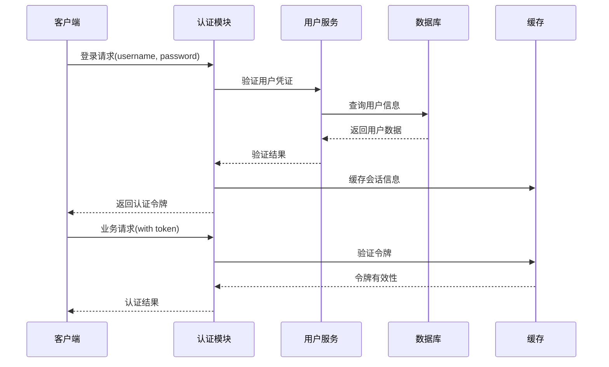

### 4.3 业务逻辑层设计

#### 4.3.1 服务层接口定义

**AuthService 认证服务**:
```go
type AuthService interface {
    // 用户认证
    AuthenticateUser(ctx context.Context, req *AuthenticateUserRequest) (*AuthenticateUserResponse, error)
    // 令牌验证
    ValidateToken(ctx context.Context, req *ValidateTokenRequest) (*ValidateTokenResponse, error)
    // 权限检查
    CheckPermission(ctx context.Context, req *CheckPermissionRequest) (*CheckPermissionResponse, error)
    // 刷新令牌
    RefreshToken(ctx context.Context, req *RefreshTokenRequest) (*RefreshTokenResponse, error)
    // 用户登出
    RevokeToken(ctx context.Context, req *RevokeTokenRequest) (*RevokeTokenResponse, error)
}
```

**UserService 用户服务**:
```go
type UserService interface {
    // 获取用户信息
    GetUserByID(ctx context.Context, req *GetUserByIDRequest) (*GetUserByIDResponse, error)
    // 根据用户名获取用户
    GetUserByUsername(ctx context.Context, req *GetUserByUsernameRequest) (*GetUserByUsernameResponse, error)
    // 验证用户密码
    VerifyPassword(ctx context.Context, req *VerifyPasswordRequest) (*VerifyPasswordResponse, error)
    // 更新最后登录时间
    UpdateLastLogin(ctx context.Context, req *UpdateLastLoginRequest) (*UpdateLastLoginResponse, error)
}
```

**PermissionService 权限服务**:
```go
type PermissionService interface {
    // 获取用户权限
    GetUserPermissions(ctx context.Context, req *GetUserPermissionsRequest) (*GetUserPermissionsResponse, error)
    // 获取用户角色
    GetUserRoles(ctx context.Context, req *GetUserRolesRequest) (*GetUserRolesResponse, error)
    // 检查特定权限
    HasPermission(ctx context.Context, req *HasPermissionRequest) (*HasPermissionResponse, error)
}
```

#### 4.3.2 请求响应结构体定义

**AuthService 相关结构体**:
```go
// 用户认证请求
type AuthenticateUserRequest struct {
    Username    string            `json:"username" validate:"required"`
    Password    string            `json:"password" validate:"required"`
    LoginType   string            `json:"login_type"`
    ClientInfo  *ClientInfo       `json:"client_info,omitempty"`
    Context     map[string]string `json:"context,omitempty"`
}

// 用户认证响应
type AuthenticateUserResponse struct {
    Success      bool         `json:"success"`
    AccessToken  string       `json:"access_token,omitempty"`
    RefreshToken string       `json:"refresh_token,omitempty"`
    ExpiresIn    int64        `json:"expires_in,omitempty"`
    UserInfo     *UserInfo    `json:"user_info,omitempty"`
    ErrorCode    string       `json:"error_code,omitempty"`
    ErrorMessage string       `json:"error_message,omitempty"`
}

// 令牌验证请求
type ValidateTokenRequest struct {
    Token           string `json:"token" validate:"required"`
    CheckUserStatus bool   `json:"check_user_status"`
}

// 令牌验证响应
type ValidateTokenResponse struct {
    Valid       bool          `json:"valid"`
    Claims      *TokenClaims  `json:"claims,omitempty"`
    UserInfo    *UserInfo     `json:"user_info,omitempty"`
    ExpiresAt   int64         `json:"expires_at,omitempty"`
    ErrorCode   string        `json:"error_code,omitempty"`
    ErrorMessage string       `json:"error_message,omitempty"`
}

// 权限检查请求
type CheckPermissionRequest struct {
    UserID   int64             `json:"user_id" validate:"required"`
    Resource string            `json:"resource" validate:"required"`
    Action   string            `json:"action" validate:"required"`
    Context  map[string]string `json:"context,omitempty"`
}

// 权限检查响应
type CheckPermissionResponse struct {
    Granted          bool                `json:"granted"`
    PermissionSource string              `json:"permission_source,omitempty"`
    MatchedRoles     []string            `json:"matched_roles,omitempty"`
    Permissions      []*PermissionDetail `json:"permissions,omitempty"`
    ErrorCode        string              `json:"error_code,omitempty"`
    ErrorMessage     string              `json:"error_message,omitempty"`
}

// 刷新令牌请求
type RefreshTokenRequest struct {
    RefreshToken string `json:"refresh_token" validate:"required"`
}

// 刷新令牌响应
type RefreshTokenResponse struct {
    Success      bool      `json:"success"`
    AccessToken  string    `json:"access_token,omitempty"`
    RefreshToken string    `json:"refresh_token,omitempty"`
    ExpiresIn    int64     `json:"expires_in,omitempty"`
    UserInfo     *UserInfo `json:"user_info,omitempty"`
    ErrorCode    string    `json:"error_code,omitempty"`
    ErrorMessage string    `json:"error_message,omitempty"`
}

// 撤销令牌请求
type RevokeTokenRequest struct {
    Token string `json:"token" validate:"required"`
}

// 撤销令牌响应
type RevokeTokenResponse struct {
    Success      bool   `json:"success"`
    ErrorCode    string `json:"error_code,omitempty"`
    ErrorMessage string `json:"error_message,omitempty"`
}
```

**UserService 相关结构体**:
```go
// 根据ID获取用户请求
type GetUserByIDRequest struct {
    UserID      int64    `json:"user_id" validate:"required"`
    IncludeRoles bool    `json:"include_roles"`
    IncludePermissions bool `json:"include_permissions"`
}

// 根据ID获取用户响应
type GetUserByIDResponse struct {
    User         *User  `json:"user,omitempty"`
    ErrorCode    string `json:"error_code,omitempty"`
    ErrorMessage string `json:"error_message,omitempty"`
}

// 根据用户名获取用户请求
type GetUserByUsernameRequest struct {
    Username    string `json:"username" validate:"required"`
    IncludeRoles bool  `json:"include_roles"`
    IncludePermissions bool `json:"include_permissions"`
}

// 根据用户名获取用户响应
type GetUserByUsernameResponse struct {
    User         *User  `json:"user,omitempty"`
    ErrorCode    string `json:"error_code,omitempty"`
    ErrorMessage string `json:"error_message,omitempty"`
}

// 验证密码请求
type VerifyPasswordRequest struct {
    UserID   int64  `json:"user_id" validate:"required"`
    Password string `json:"password" validate:"required"`
}

// 验证密码响应
type VerifyPasswordResponse struct {
    Valid        bool   `json:"valid"`
    ErrorCode    string `json:"error_code,omitempty"`
    ErrorMessage string `json:"error_message,omitempty"`
}

// 更新最后登录时间请求
type UpdateLastLoginRequest struct {
    UserID    int64       `json:"user_id" validate:"required"`
    LoginTime *time.Time  `json:"login_time,omitempty"`
    ClientIP  string      `json:"client_ip,omitempty"`
}

// 更新最后登录时间响应
type UpdateLastLoginResponse struct {
    Success      bool   `json:"success"`
    ErrorCode    string `json:"error_code,omitempty"`
    ErrorMessage string `json:"error_message,omitempty"`
}
```

**PermissionService 相关结构体**:
```go
// 获取用户权限请求
type GetUserPermissionsRequest struct {
    UserID        int64 `json:"user_id" validate:"required"`
    IncludeExpired bool `json:"include_expired"`
}

// 获取用户权限响应
type GetUserPermissionsResponse struct {
    Permissions  *UserPermissions `json:"permissions,omitempty"`
    ErrorCode    string           `json:"error_code,omitempty"`
    ErrorMessage string           `json:"error_message,omitempty"`
}

// 获取用户角色请求
type GetUserRolesRequest struct {
    UserID        int64 `json:"user_id" validate:"required"`
    IncludeExpired bool `json:"include_expired"`
}

// 获取用户角色响应
type GetUserRolesResponse struct {
    Roles        []*Role `json:"roles,omitempty"`
    ErrorCode    string  `json:"error_code,omitempty"`
    ErrorMessage string  `json:"error_message,omitempty"`
}

// 检查权限请求
type HasPermissionRequest struct {
    UserID   int64             `json:"user_id" validate:"required"`
    Resource string            `json:"resource" validate:"required"`
    Action   string            `json:"action" validate:"required"`
    Context  map[string]string `json:"context,omitempty"`
}

// 检查权限响应
type HasPermissionResponse struct {
    HasPermission    bool                `json:"has_permission"`
    PermissionSource string              `json:"permission_source,omitempty"`
    MatchedRoles     []string            `json:"matched_roles,omitempty"`
    Permissions      []*PermissionDetail `json:"permissions,omitempty"`
    ErrorCode        string              `json:"error_code,omitempty"`
    ErrorMessage     string              `json:"error_message,omitempty"`
}
```

**通用辅助结构体**:
```go
// 客户端信息
type ClientInfo struct {
    DeviceID  string `json:"device_id,omitempty"`
    IPAddress string `json:"ip_address,omitempty"`
    UserAgent string `json:"user_agent,omitempty"`
    Platform  string `json:"platform,omitempty"`
}

// 权限详情
type PermissionDetail struct {
    Resource    string    `json:"resource"`
    Action      string    `json:"action"`
    Source      string    `json:"source"` // direct, role, inherited
    RoleName    string    `json:"role_name,omitempty"`
    ExpiresAt   *time.Time `json:"expires_at,omitempty"`
}
```

#### 4.3.3 业务逻辑实现要点

**1. 用户认证逻辑**
- **参数验证**: 使用`Validator`接口验证输入参数
- **防暴力破解**: 通过`BruteForceProtector`检查登录尝试
- **密码验证**: 使用`PasswordHasher`接口验证密码
- **令牌生成**: 通过`TokenGenerator`生成JWT访问令牌
- **会话管理**: 使用`SessionManager`管理用户会话

**2. 权限验证逻辑**
- **权限缓存**: 通过`PermissionCache`缓存用户权限信息
- **权限计算**: 合并直接权限和角色权限
- **通配符匹配**: 支持资源和操作的通配符权限
- **权限继承**: 支持角色权限的层级继承

**3. 令牌管理逻辑**
- **令牌生成**: JWT令牌包含用户ID、角色、过期时间等信息
- **令牌验证**: 验证签名、过期时间、黑名单状态
- **令牌刷新**: 支持无感刷新和令牌轮换机制
- **令牌撤销**: 通过黑名单机制实现令牌撤销

#### 4.3.4 工具类和辅助服务

**密码处理工具**:
```go
type PasswordHasher interface {
    HashPassword(password string) (string, error)
    ComparePassword(hashedPassword, password string) bool
}
```

**令牌处理工具**:
```go
type TokenGenerator interface {
    GenerateAccessToken(user *User) (string, error)
    GenerateRefreshToken(userID int64) (string, error)
    ParseToken(token string) (*TokenClaims, error)
    ValidateToken(token string) error
}
```

**防暴力破解工具**:
```go
type BruteForceProtector interface {
    IsAccountLocked(username string) bool
    RecordFailedAttempt(username string) error
    ClearFailedAttempts(username string) error
}
```

**会话管理器**:
```go
type SessionManager interface {
    CreateSession(userID int64, sessionData *SessionData) error
    GetSession(userID int64) (*SessionData, error)
    UpdateSession(userID int64, sessionData *SessionData) error
    DeleteSession(userID int64) error
}
```

### 4.4 核心算法流程图

#### 4.4.1 Login() 登录认证流程
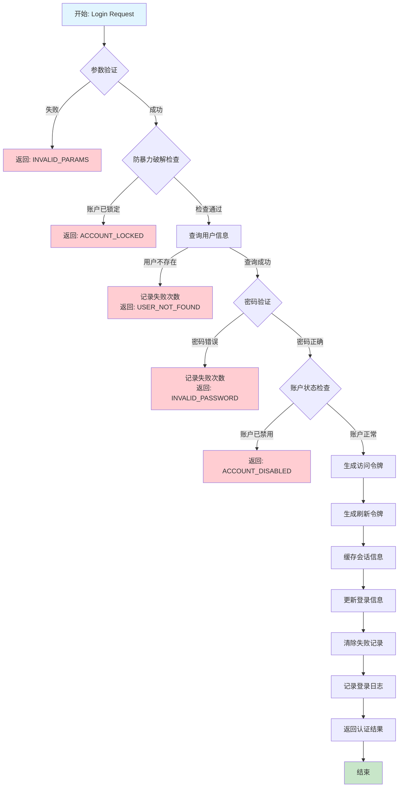

#### 4.4.2 ValidateToken() 令牌验证流程
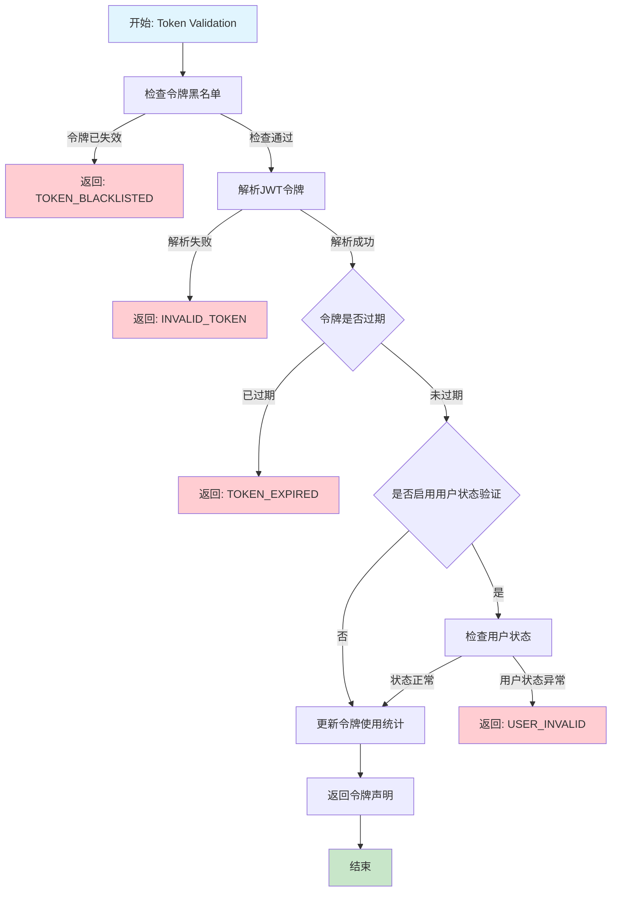

#### 4.4.3 CheckPermission() 权限检查流程
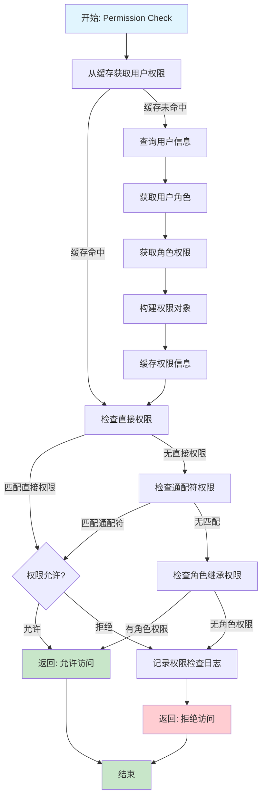

#### 4.4.4 RefreshToken() 令牌刷新流程
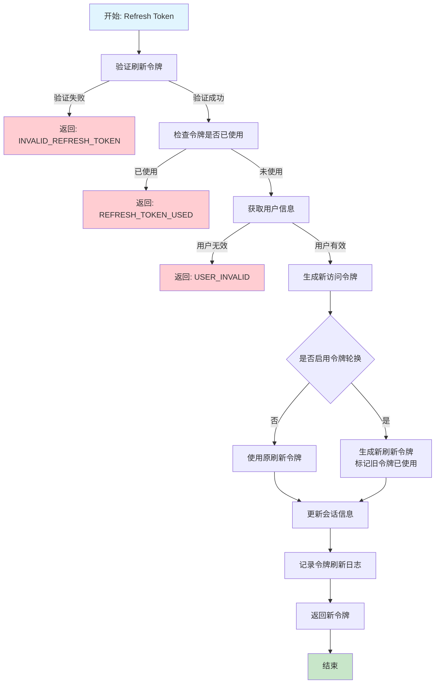

#### 4.4.5 Logout() 登出流程
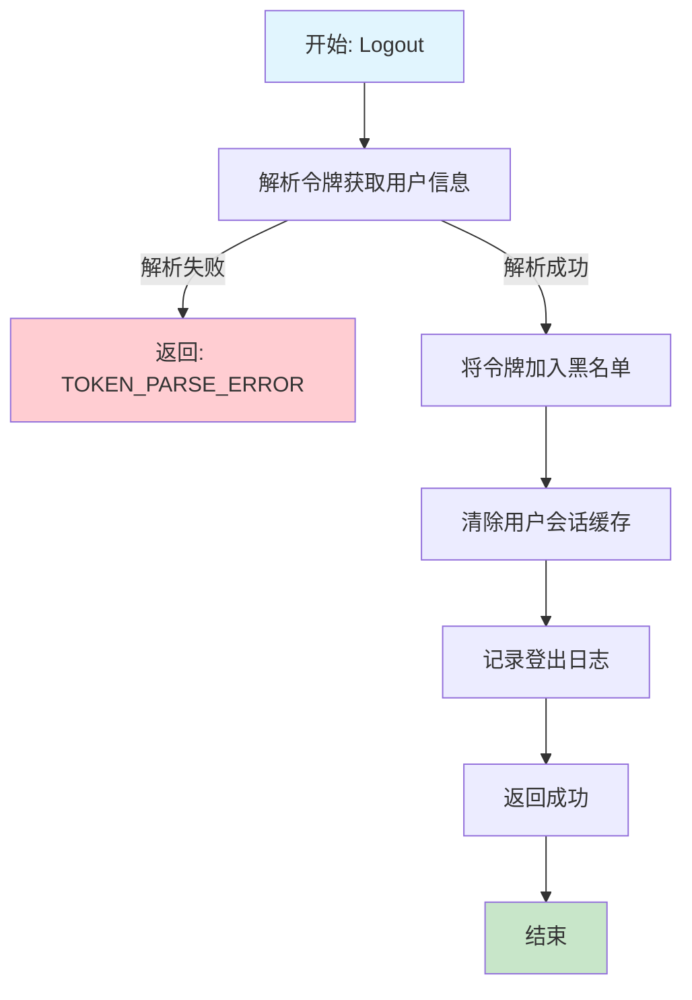

#### 4.4.6 密码哈希和验证流程
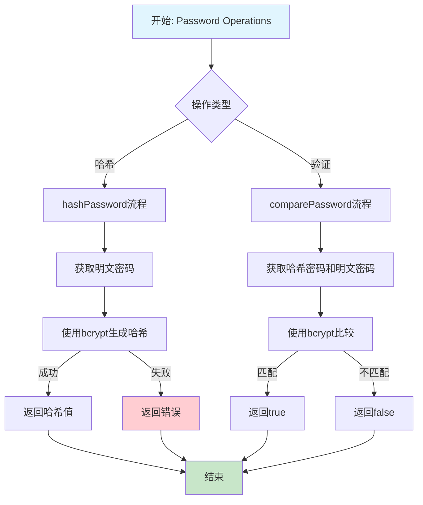

#### 4.4.7 JWT令牌操作流程
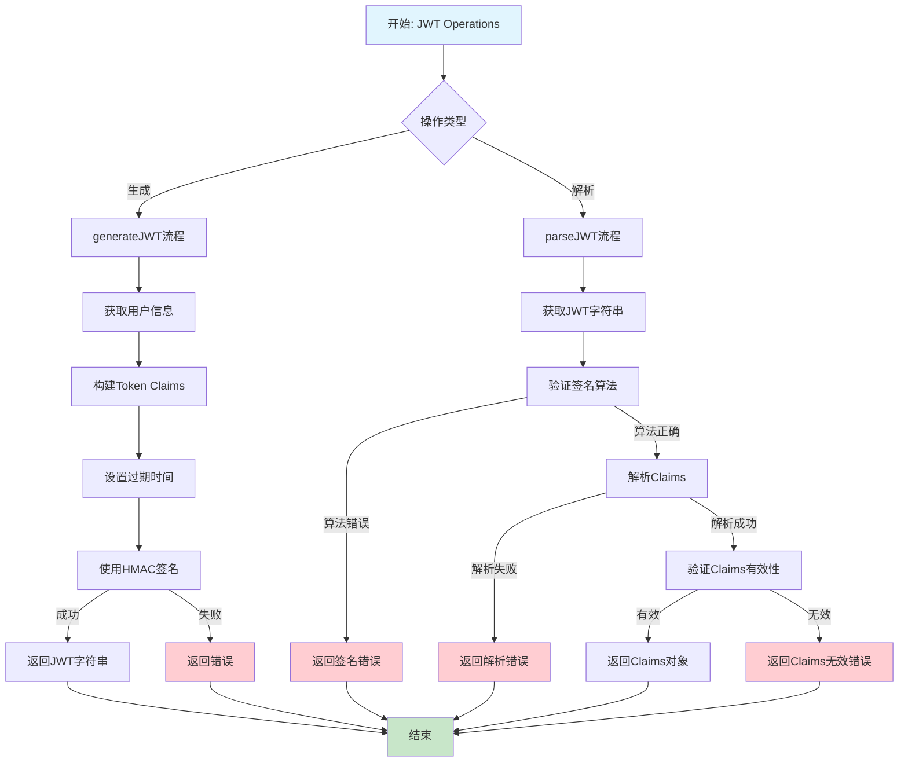

#### 4.4.8 防暴力破解机制流程
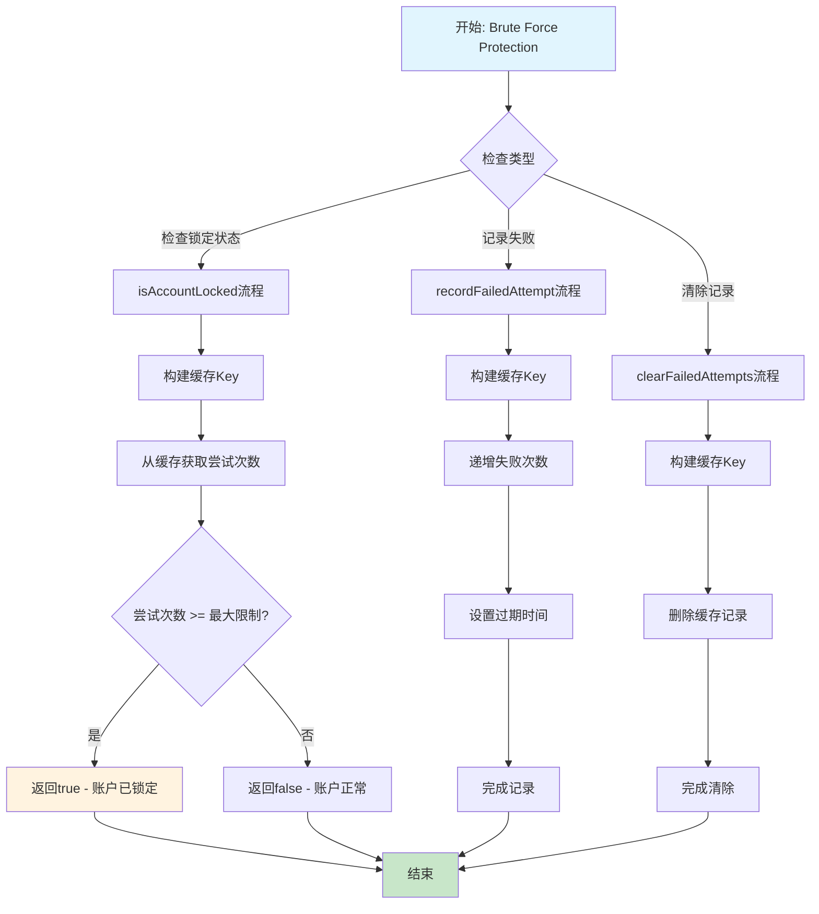

#### 复杂度分析
- **时间复杂度**：
  - Login: O(1) - 基于哈希表和索引查询
  - ValidateToken: O(1) - JWT解析和缓存查询
  - CheckPermission: O(n) - n为用户权限数量，通常很小
  - RefreshToken: O(1) - 令牌操作和缓存更新
  - Logout: O(1) - 缓存操作

- **空间复杂度**：
  - 所有接口: O(1) - 固定大小的用户信息和令牌数据
  - 权限缓存: O(m) - m为用户权限总数，通过TTL控制

## 5. 跨语言实现规范

### 5.1 通用接口定义（各语言统一规范）

#### 5.1.1 接口约定
所有语言实现必须遵循以下接口约定：

**错误码统一定义**：
```
INVALID_PARAMS       - 参数验证失败
ACCOUNT_LOCKED      - 账户被锁定
USER_NOT_FOUND      - 用户不存在
INVALID_PASSWORD    - 密码错误
ACCOUNT_DISABLED    - 账户已禁用
TOKEN_BLACKLISTED   - 令牌已失效
INVALID_TOKEN       - 无效令牌
TOKEN_EXPIRED       - 令牌已过期
USER_INVALID        - 用户状态异常
INVALID_REFRESH_TOKEN - 刷新令牌无效
REFRESH_TOKEN_USED  - 刷新令牌已使用
TOKEN_PARSE_ERROR   - 令牌解析错误
PERMISSION_DENIED   - 权限拒绝
```

**HTTP状态码约定**：
```
200 - 操作成功
400 - 请求参数错误
401 - 身份验证失败
403 - 权限不足
423 - 账户被锁定
500 - 服务器内部错误
```

#### 5.1.2 各语言接口实现模板

**Go语言实现规范**：
```go
type AuthService interface {
    Login(ctx context.Context, req *AuthRequest) (*AuthResponse, error)
    Logout(ctx context.Context, token string) error
    ValidateToken(ctx context.Context, token string) (*TokenClaims, error)
    CheckPermission(ctx context.Context, userID int64, resource, action string) (bool, error)
    RefreshToken(ctx context.Context, refreshToken string) (*AuthResponse, error)
}
```

**Java语言实现规范**：
```java
public interface AuthService {
    CompletableFuture<AuthResponse> login(AuthRequest request);
    CompletableFuture<Void> logout(String token);
    CompletableFuture<TokenClaims> validateToken(String token);
    CompletableFuture<Boolean> checkPermission(Long userId, String resource, String action);
    CompletableFuture<AuthResponse> refreshToken(String refreshToken);
}
```

**Python语言实现规范**：
```python
from abc import ABC, abstractmethod
from typing import Optional
import asyncio

class AuthService(ABC):
    @abstractmethod
    async def login(self, request: AuthRequest) -> AuthResponse:
        pass
    
    @abstractmethod
    async def logout(self, token: str) -> None:
        pass
    
    @abstractmethod
    async def validate_token(self, token: str) -> TokenClaims:
        pass
    
    @abstractmethod
    async def check_permission(self, user_id: int, resource: str, action: str) -> bool:
        pass
    
    @abstractmethod
    async def refresh_token(self, refresh_token: str) -> AuthResponse:
        pass
```

**Node.js/TypeScript实现规范**：
```typescript
interface AuthService {
    login(request: AuthRequest): Promise<AuthResponse>;
    logout(token: string): Promise<void>;
    validateToken(token: string): Promise<TokenClaims>;
    checkPermission(userId: number, resource: string, action: string): Promise<boolean>;
    refreshToken(refreshToken: string): Promise<AuthResponse>;
}
```

**C#实现规范**：
```csharp
public interface IAuthService
{
    Task<AuthResponse> LoginAsync(AuthRequest request);
    Task LogoutAsync(string token);
    Task<TokenClaims> ValidateTokenAsync(string token);
    Task<bool> CheckPermissionAsync(long userId, string resource, string action);
    Task<AuthResponse> RefreshTokenAsync(string refreshToken);
}
```

#### 5.1.3 数据传输对象（DTO）跨语言映射

**JSON格式规范**（所有语言统一使用）：
```json
{
  "AuthRequest": {
    "username": "string",
    "password": "string", 
    "login_type": "password|token|sso"
  },
  "AuthResponse": {
    "success": "boolean",
    "access_token": "string?",
    "refresh_token": "string?",
    "expires_in": "number?",
    "user_info": "UserInfo?",
    "error_code": "string?",
    "error_msg": "string?"
  },
  "UserInfo": {
    "id": "number",
    "username": "string",
    "email": "string",
    "roles": "string[]",
    "permissions": "string[]"
  },
  "TokenClaims": {
    "user_id": "number",
    "username": "string", 
    "roles": "string[]",
    "iat": "number",
    "exp": "number"
  }
}
```

#### 5.1.4 配置参数跨语言映射

**配置文件格式（YAML）**：
```yaml
auth:
  jwt:
    secret: "${JWT_SECRET}"
    issuer: "your-service"
    audience: "your-app"
    access_token_expire: "3600s"
    refresh_token_expire: "604800s"
  
  security:
    max_login_attempts: 5
    lockout_duration: "900s" 
    bcrypt_cost: 12
    validate_user_status: true
    refresh_token_rotation: true
  
  cache:
    session_expire: "86400s"
    permission_cache_expire: "1800s"
```

**环境变量映射**：
```bash
# 必需环境变量
JWT_SECRET=your-jwt-secret-key
DATABASE_URL=your-database-connection

# 可选环境变量  
REDIS_URL=redis://localhost:6379
MAX_LOGIN_ATTEMPTS=5
LOCKOUT_DURATION=900
BCRYPT_COST=12
```

### 5.2 各语言特定实现要点

#### Go语言实现要点
- 使用`context.Context`进行超时和取消控制
- 使用`sync.RWMutex`保护并发访问
- 错误处理使用`fmt.Errorf`包装错误
- 使用`github.com/golang-jwt/jwt`库处理JWT

#### Java语言实现要点  
- 使用`CompletableFuture`支持异步操作
- 使用`@Cacheable`注解实现权限缓存
- 错误处理使用自定义异常类
- 使用Spring Security集成

#### Python语言实现要点
- 使用`async/await`支持异步操作
- 使用`aioredis`进行异步缓存操作
- 错误处理使用自定义异常类
- 使用`PyJWT`库处理JWT令牌

#### Node.js/TypeScript实现要点
- 使用`Promise`和`async/await`
- 使用`redis`客户端进行缓存
- 错误处理使用自定义Error类
- 使用`jsonwebtoken`库处理JWT

#### C#实现要点
- 使用`Task`和`async/await`模式
- 使用`IMemoryCache`或`IDistributedCache`
- 错误处理使用自定义异常类
- 使用`System.IdentityModel.Tokens.Jwt`

### 5.3 模块结构设计

#### 通用目录结构
```
auth-module/
├── controllers/       # 控制器层 - HTTP路由处理
├── services/         # 服务层 - 业务逻辑实现  
├── repositories/     # 数据访问层 - 数据库操作
├── models/          # 数据模型 - 实体定义
├── middleware/      # 中间件 - 认证拦截器
├── utils/           # 工具类 - 通用函数
├── config/          # 配置 - 参数定义
├── tests/           # 测试 - 单元测试和集成测试
└── docs/           # 文档 - API文档和使用说明
```

### 5.4 API调用总览流程图
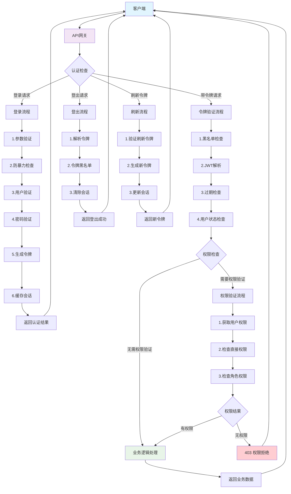

### 5.5 跨语言实现检查清单

#### 必须实现的核心功能
- [ ] **Login接口**：完整的9步登录流程
- [ ] **ValidateToken接口**：5步令牌验证流程  
- [ ] **CheckPermission接口**：权限检查和缓存机制
- [ ] **RefreshToken接口**：令牌刷新和轮换
- [ ] **Logout接口**：令牌黑名单和会话清理

#### 必须实现的安全特性
- [ ] **密码哈希**：bcrypt加密存储
- [ ] **JWT令牌**：签名验证和过期检查
- [ ] **防暴力破解**：登录失败次数限制
- [ ] **令牌黑名单**：登出后令牌失效
- [ ] **权限缓存**：提高权限检查性能

#### 必须实现的监控和日志
- [ ] **登录日志**：成功/失败记录
- [ ] **权限日志**：权限检查记录
- [ ] **错误日志**：异常情况记录
- [ ] **性能监控**：响应时间统计
- [ ] **安全告警**：异常登录检测

#### 必须通过的测试用例
- [ ] **单元测试**：所有核心方法覆盖
- [ ] **集成测试**：完整流程测试
- [ ] **性能测试**：并发和负载测试
- [ ] **安全测试**：攻击防护验证
- [ ] **兼容性测试**：多语言互操作

### 5.6 实现细节
- **并发处理**：使用读写锁保护会话缓存，支持高并发访问
- **错误处理**：统一错误码定义，详细的错误日志记录
- **缓存策略**：Redis缓存用户会话，TTL设置为令牌过期时间
- **监控埋点**：记录认证成功率、响应时间、错误分布等指标

### 5.7 配置参数
| 参数名 | 默认值 | 说明 | 范围 |
|--------|--------|------|------|
| jwt_secret | "" | JWT签名密钥 | 必须配置 |
| access_token_expire | 3600s | 访问令牌过期时间 | 300s-86400s |
| refresh_token_expire | 604800s | 刷新令牌过期时间 | 3600s-2592000s |
| max_login_attempts | 5 | 最大登录尝试次数 | 3-10 |
| lockout_duration | 900s | 账户锁定时长 | 300s-3600s |
| bcrypt_cost | 12 | 密码哈希强度 | 10-15 |

## 6. 测试设计
### 6.1 单元测试覆盖
- **登录功能测试**：正常登录、密码错误、用户不存在
- **令牌验证测试**：有效令牌、过期令牌、无效签名
- **权限检查测试**：有权限访问、无权限拒绝、角色权限继承
- **边界条件测试**：空参数、超长字符串、特殊字符处理
- **并发测试**：多用户同时登录、令牌并发验证

### 6.2 集成测试
- **登录到业务调用**：完整的认证授权流程测试
- **令牌刷新流程**：访问令牌过期后的自动刷新
- **跨模块权限验证**：不同业务模块的权限检查

### 6.3 性能测试
- **负载测试**：10000并发登录请求，响应时间 < 100ms
- **压力测试**：持续高负载下的系统稳定性
- **内存泄漏测试**：长时间运行的内存使用监控

## 7. 风险与限制
### 7.1 已知限制
- 单点登录场景下，用户在一个终端登出不会影响其他终端
- 权限变更需要等待令牌过期才能生效（除非强制刷新）
- 大量并发登录可能对数据库造成压力

### 7.2 潜在风险点
- **安全风险**：密码暴力破解、令牌泄露、会话劫持
- **性能风险**：缓存击穿导致数据库压力过大
- **可用性风险**：Redis缓存故障影响认证服务

### 7.3 降级方案
- **缓存降级**：Redis故障时切换到数据库会话存储
- **认证降级**：系统异常时提供只读访问权限
- **限流保护**：触发异常时启用请求限流和熔断机制

---

**文档版本**: v1.0  
**创建时间**: 2025-08-13  
**最后更新**: 2025-08-13  
**维护人员**: 开发团队
